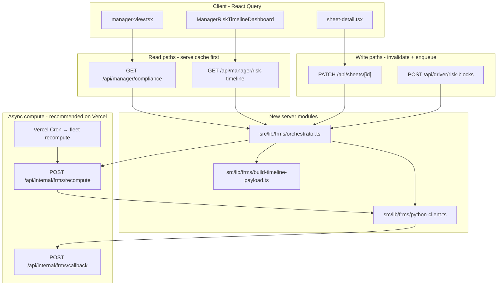

# FRMS Python integration — architecture & implementation plan

**Circadia24 (`app-next`)** — upgrade path to an AI-driven, predictive Fatigue Risk Management System (FRMS).

**Status:** Proposed — `build-timeline-payload.ts` implemented; Python service and Neon models pending  
**Last updated:** 2026-06  
**Related:** [ADR 0003](../adr/0003-prospective-risk-engine.md), [camera-risk-stream](./camera-risk-stream.md), [fatigue-risk-sawtooth-model](./fatigue-risk-sawtooth-model.md)

---

## Executive summary

The new risk engine will combine **biomathematical models of fatigue** (Process S and Process C) with a **machine learning regressor** (e.g. XGBoost) and **external time-series enrichment**. It must run **entirely server-side** via an external **Python (FastAPI) microservice** because of:

- Vercel serverless compute limits
- Server-side data enrichment (roster, weather, etc.)
- IP protection for models and features

This document is tailored to the **current repository**: Next.js 16 App Router, Prisma + Neon, no Server Actions, ADR 0003 compliance vs risk split, existing `DriverRiskBlock` ingest, and in-process TypeScript risk modules.

---

## Current stack (baseline)

| Area | Location | Role today |
|------|----------|------------|
| Compliance (retrospective) | `src/lib/compliance.ts`, jurisdiction engines | Rule breaches on attested record |
| Prospective register | `src/lib/risk-register.ts`, `risk-scenarios.ts`, `risk-evaluate.ts` | Future legs with run plans only (ADR 0003) |
| Rolling state input | `src/lib/compliance-state.ts` | `complianceStateAt()` from logged data |
| Manager week API | `GET /api/manager/compliance` | Runs compliance + `buildRiskRegister()` per sheet |
| 15-min timeline (chart) | `GET /api/manager/risk-timeline`, `src/lib/manager-risk-timeline.ts` | Sawtooth carry + camera fusion |
| Camera ingest | `POST /api/driver/risk-blocks`, `DriverRiskBlock` (Prisma) | Idempotent 15-min blocks |
| Sheet writes | `PATCH /api/sheets/[id]` | `days` JSON including run plans |
| Client API | `src/lib/api.ts` (React Query) | No Server Actions |
| Timeline payload (FRMS input) | `src/lib/frms/build-timeline-payload.ts` | Flattens sheet weeks → 15-min `timeline_blocks` + SHA256 `inputHash` |

**Explicitly out of scope for v1 FRMS (per ADR 0003):** replacing compliance math, NHVR biomathematical certification claims, blocking drivers when catalogue/roster is empty.

---

## 1. Where to intercept timeline data

### Principle

- **Do not** call Python from the browser.
- **Do not** use Server Actions (none exist today; keep Route Handlers + `api.ts`).
- **Do not** replace `compliance.ts` — FRMS is assurance/coaching; compliance stays retrospective.
- Introduce a **single orchestrator** (`src/lib/frms/orchestrator.ts`) invoked at existing API boundaries.

### Data flow (target)



### Interception points (priority order)

| Priority | Existing route | What it does today | FRMS hook |
|----------|----------------|-------------------|-----------|
| **A** | `src/app/api/manager/compliance/route.ts` | Loads `FatigueSheet`, `engine.run()` + **`buildRiskRegister()`** per sheet | **Best fleet/week orchestration.** Build canonical timeline payload per driver (history + focus/prior weeks + future run plans). Serve cached FRMS output; if `inputHash` stale, enqueue recompute; return legacy register until `status=ready`. |
| **B** | `src/app/api/manager/risk-timeline/route.ts` | Reads **`DriverRiskBlock`**, `buildRiskTimelineFromStoredBlocks()` | **Best 15-min series.** Persist Python Process S/C + model scores in **`FrmsRiskSnapshot`**; route reads snapshots (optionally merge camera `livePct` from `DriverRiskBlock`). |
| **C** | `src/app/api/sheets/[id]/route.ts` **`PATCH`** | Persists `days` JSON (run plans, grids) | On `days` / run-plan change: `invalidateAndEnqueue({ driverName, weekStarting, trigger: "sheet_patch" })`. **Do not** block PATCH on Python latency. |
| **D** | `src/app/api/driver/risk-blocks/route.ts` **`POST`** | `ingestDriverRiskBlockBatch()` → TS `computeFusedRiskPercents()` | Keep ingest fast. Enqueue FRMS recompute for rolling window **or** send new blocks only to Python for live refinement; **(1) enqueue** scales better on Vercel. |

### New internal routes (not exposed in UI)

| Route | Role |
|-------|------|
| `POST /api/internal/frms/recompute` | Build payload → call FastAPI → persist snapshots. Guard: `Authorization: Bearer ${FRMS_INTERNAL_SECRET}` or Vercel Cron secret. |
| `POST /api/internal/frms/callback` | Optional: FastAPI pushes results if compute exceeds serverless timeout (HMAC on body). |
| `GET /api/internal/frms/health` | Ops: ping Python + DB. |

**Route handler settings** (match existing risk routes):

```ts
export const runtime = "nodejs";
export const dynamic = "force-dynamic";
export const maxDuration = 60; // Vercel Pro — tune to Python SLA
```

### Vercel latency pattern

**Do not** hold `GET /api/manager/compliance` open for XGBoost.

1. Read path returns **last good** `FrmsProfileRun` + snapshots.
2. Feature flag: `FRMS_ENGINE=legacy | hybrid | python`.
3. If cache miss/stale: return TypeScript `buildRiskRegister()` (hybrid) and **enqueue** recompute.
4. For fleet-wide jobs use **QStash / Inngest / Trigger.dev** (recommended before hourly cron at scale).

### Environment variables (Vercel only)

| Variable | Purpose |
|----------|---------|
| `FRMS_PYTHON_URL` | FastAPI base URL |
| `FRMS_PYTHON_API_KEY` | Bearer token to Python |
| `FRMS_INTERNAL_SECRET` | Protect internal recompute/callback |
| `FRMS_ENGINE` | `legacy` \| `hybrid` \| `python` |

---

## 2. Neon schema — Risk Profiles without bloat

### Do not overload `DriverRiskBlock`

`DriverRiskBlock` is optimized for **high-volume camera ingest** (`uploadId` idempotency, `cameraPayload` JSON). Do not store XGBoost feature vectors or full roster payloads per block.

### Proposed Prisma models

```prisma
/// One FRMS computation for a driver + horizon (deduped by input hash).
model FrmsProfileRun {
  id              String    @id @default(cuid())
  driverName      String
  userId          String?   /// sheet owner when known
  weekStarting    String?   /// manager focus week, optional
  horizonFromMs   BigInt
  horizonToMs     BigInt
  timezone        String    @default("Australia/Perth")
  engineVersion   String    /// e.g. "frms-py-1"
  modelVersion    String?   /// xgboost artifact id
  inputHash       String    /// sha256(canonical payload)
  status          String    @default("pending") // pending | ready | failed
  errorMessage    String?
  sources         String[]  @default([])       // diary, roster, weather, camera
  /// ADR 0003 segment register (future legs only) — mirrors RiskRegisterResult JSON
  prospectiveRegister Json?
  requestedAt     DateTime  @default(now())
  completedAt     DateTime?
  snapshots       FrmsRiskSnapshot[]

  @@unique([driverName, inputHash, engineVersion])
  @@index([driverName, weekStarting, status])
  @@index([status, requestedAt])
}

/// 15-minute FRMS profile points (aligned with RISK_BLOCK_MINUTES).
model FrmsRiskSnapshot {
  id             String   @id @default(cuid())
  runId          String
  run            FrmsProfileRun @relation(fields: [runId], references: [id], onDelete: Cascade)
  blockStartMs   BigInt
  blockMinutes   Int      @default(15)
  processSPct    Float?   /// biomathematical S
  processCPct    Float?   /// biomathematical C
  modelPct       Float?   /// ML regressor output
  combinedPct    Int      /// 0-100 manager glance
  band           String?  /// low | monitor | elevated | critical
  createdAt      DateTime @default(now())

  @@unique([runId, blockStartMs])
  @@index([runId, blockStartMs])
}
```

### Anti-bloat rules

1. **Never store the full timeline payload** in Postgres — only `inputHash` + compact `sources`. Rebuild from `FatigueSheet` + `DriverRiskBlock` when recomputing.
2. **Upsert snapshots** on `(runId, blockStartMs)`; do not append unbounded rows per request.
3. **Dedupe runs** via `@@unique([driverName, inputHash, engineVersion])`.
4. **Retention cron:** delete runs where `completedAt < now() - 90d` (align with assurance surfaces in `record-retention.ts`). Cascade deletes snapshots.
5. **Keep `DriverRiskBlock`** for camera provenance; FRMS reads it when building payload but stores **derived** scores in `FrmsRiskSnapshot`.
6. **Partitioning** on `blockStartMs` — optional later on Neon if snapshot volume exceeds ~1M rows.

### Mapping to current types

| Today | FRMS storage |
|--------|----------------|
| `buildRiskRegister()` → `ManagerComplianceItem.risk_register` | `FrmsProfileRun.prospectiveRegister` (JSON) |
| `RiskTimelineBlock.baselinePct` / `livePct` | `FrmsRiskSnapshot.processSPct`, `processCPct`, `modelPct`, `combinedPct` |
| `DriverRiskBlock.livePct` | Overlay “observed” in hybrid chart mode |

### Driver identity

Sheets use **`driverName` string** (not always `Driver.id` FK). FRMS runs should key on `driverName` consistently with `DriverRiskBlock` and manager APIs.

---

## 3. Timeline payload builder (implemented)

**Module:** `src/lib/frms/build-timeline-payload.ts`  
**Tests:** `src/lib/frms/build-timeline-payload.test.ts`

### Purpose

Flatten **historical and prospective** driver fatigue sheets (all weeks in `weekMap`) into a single **chronological, 15-minute time-series** array for the Python FRMS engine. Compute a stable **SHA256 `inputHash`** so `FrmsProfileRun` can skip duplicate Neon writes when nothing changed.

### Payload shape (`FrmsTimelinePayload`)

| Field | Meaning |
|-------|---------|
| `schema_version` | `1` |
| `driver_name`, `jurisdiction_code`, `driver_type` | Driver context |
| `timezone` | `"Australia/Perth"` (aligned with manager timeline) |
| `as_of_ms` | Current block start (`findNowBlockStartMs`) |
| `horizon_from_ms` | 14 days before `as_of_ms`, block-aligned |
| `horizon_to_ms` | 7 days after `as_of_ms`, block-aligned |
| `week_starting` | Manager focus week (YYYY-MM-DD Sunday) |
| `timeline_blocks` | Dense array: one row per 15-min slot in the horizon |
| `enrichment` | Optional external series (e.g. `weather_hourly`) |

Each `timeline_blocks` entry:

```typescript
{
  start_ms: number;   // UTC ms, 15-min aligned (RISK_BLOCK_MINUTES)
  is_work: boolean;   // work/driving dominates the block
  is_rest: boolean;   // break/rest/non-work dominates (no work)
}
```

### How sheets are flattened

1. Sort all keys in `weekMap` (chronological weeks).
2. For each week, `parseSheetDaysJson(days)` → 7 day objects.
3. Per day, accumulate minute activity into 15-minute buckets:
   - **Primary:** `work_time` / `breaks` / `non_work` minute grids (`normalizeDayCoverageArrays`).
   - **Optional:** `day.intervals[]` with `{ startMs, type }` when present on day JSON (`work`/`driving` vs `rest`/`sleep`/`break`).
4. Walk `horizon_from_ms` … `horizon_to_ms` in 15-minute steps; emit one block per step (empty slots → both flags `false`).

### Hashing

```typescript
export function hashFrmsPayload(payload: FrmsTimelinePayload): string {
  return createHash("sha256").update(JSON.stringify(payload)).digest("hex");
}
```

Use as `FrmsProfileRun.inputHash` — **do not** persist the full payload in Postgres (rebuild from sheets when recomputing).

### API (reference)

```typescript
export function buildFrmsTimelinePayload(input: {
  driverName: string;
  jurisdictionCode: string;
  driverType: string;
  weekStarting: string;
  weekMap: Map<string, { days: string }>;
  enrichment?: FrmsTimelinePayload["enrichment"];
}): FrmsTimelinePayload;
```

---

## 4. TypeScript boilerplate (pending modules)

### File layout

```text
src/lib/frms/
  build-timeline-payload.ts   # ✅ Implemented — timeline_blocks + inputHash
  build-timeline-payload.test.ts
  python-client.ts            # fetch() to FastAPI
  orchestrator.ts             # runFrmsAndPersist, enqueueFrmsRecompute

src/app/api/internal/frms/
  recompute/route.ts          # Worker entry
  callback/route.ts           # Optional async completion
  health/route.ts             # Ops
```

### `src/lib/frms/python-client.ts` (planned)

```typescript
import type { FrmsTimelinePayload } from "@/lib/frms/build-timeline-payload";

export type FrmsPythonResponse = {
  engine_version: string;
  model_version?: string;
  prospective_register?: unknown;
  snapshots: Array<{
    block_start_ms: number;
    process_s_pct?: number;
    process_c_pct?: number;
    model_pct?: number;
    combined_pct: number;
    band?: string;
  }>;
};

export async function callFrmsPython(
  payload: FrmsTimelinePayload,
  signal?: AbortSignal
): Promise<FrmsPythonResponse> {
  const base = process.env.FRMS_PYTHON_URL;
  const key = process.env.FRMS_PYTHON_API_KEY;
  if (!base || !key) throw new Error("FRMS_PYTHON_URL / FRMS_PYTHON_API_KEY not configured");

  const res = await fetch(`${base.replace(/\/$/, "")}/v1/risk-profile`, {
    method: "POST",
    headers: {
      "Content-Type": "application/json",
      Authorization: `Bearer ${key}`,
    },
    body: JSON.stringify(payload),
    signal,
  });

  if (!res.ok) {
    const text = await res.text().catch(() => "");
    throw new Error(`FRMS Python ${res.status}: ${text.slice(0, 500)}`);
  }

  return (await res.json()) as FrmsPythonResponse;
}
```

### `src/lib/frms/orchestrator.ts`

```typescript
import type { PrismaClient } from "@prisma/client";
import {
  buildFrmsTimelinePayload,
  hashFrmsPayload,
} from "@/lib/frms/build-timeline-payload";
import { callFrmsPython } from "@/lib/frms/python-client";

const ENGINE_VERSION = "frms-py-1";

export async function runFrmsAndPersist(
  prisma: PrismaClient,
  args: {
    driverName: string;
    weekStarting: string;
    weekMap: Map<string, { days: string }>;
    jurisdictionCode: string;
    driverType: string;
    userId?: string;
  }
): Promise<{ runId: string; status: "ready" | "failed" }> {
  const payload = buildFrmsTimelinePayload({
    driverName: args.driverName,
    weekStarting: args.weekStarting,
    weekMap: args.weekMap,
    jurisdictionCode: args.jurisdictionCode,
    driverType: args.driverType,
  });
  const inputHash = hashFrmsPayload(payload);

  const run = await prisma.frmsProfileRun.upsert({
    where: {
      driverName_inputHash_engineVersion: {
        driverName: args.driverName,
        inputHash,
        engineVersion: ENGINE_VERSION,
      },
    },
    create: {
      driverName: args.driverName,
      userId: args.userId,
      weekStarting: args.weekStarting,
      horizonFromMs: BigInt(payload.horizon_from_ms),
      horizonToMs: BigInt(payload.horizon_to_ms),
      inputHash,
      engineVersion: ENGINE_VERSION,
      status: "pending",
      sources: ["diary"],
    },
    update: { status: "pending", errorMessage: null, requestedAt: new Date() },
  });

  try {
    const result = await callFrmsPython(payload);
    await prisma.$transaction([
      prisma.frmsRiskSnapshot.deleteMany({ where: { runId: run.id } }),
      prisma.frmsRiskSnapshot.createMany({
        data: result.snapshots.map((s) => ({
          runId: run.id,
          blockStartMs: BigInt(s.block_start_ms),
          processSPct: s.process_s_pct ?? null,
          processCPct: s.process_c_pct ?? null,
          modelPct: s.model_pct ?? null,
          combinedPct: Math.round(s.combined_pct),
          band: s.band ?? null,
        })),
      }),
      prisma.frmsProfileRun.update({
        where: { id: run.id },
        data: {
          status: "ready",
          modelVersion: result.model_version ?? null,
          prospectiveRegister: result.prospective_register ?? undefined,
          completedAt: new Date(),
        },
      }),
    ]);
    return { runId: run.id, status: "ready" };
  } catch (e) {
    await prisma.frmsProfileRun.update({
      where: { id: run.id },
      data: {
        status: "failed",
        errorMessage: e instanceof Error ? e.message : "FRMS failed",
      },
    });
    return { runId: run.id, status: "failed" };
  }
}

export function enqueueFrmsRecompute(
  args: Parameters<typeof runFrmsAndPersist>[1]
): void {
  const secret = process.env.FRMS_INTERNAL_SECRET;
  const base =
    process.env.VERCEL_URL
      ? `https://${process.env.VERCEL_URL}`
      : process.env.NEXTAUTH_URL ?? "http://localhost:3000";
  if (!secret) return;

  void fetch(`${base}/api/internal/frms/recompute`, {
    method: "POST",
    headers: {
      "Content-Type": "application/json",
      Authorization: `Bearer ${secret}`,
    },
    body: JSON.stringify(args),
  }).catch(() => {});
}
```

### `src/app/api/internal/frms/recompute/route.ts`

```typescript
import { NextRequest, NextResponse } from "next/server";
import { prisma } from "@/lib/prisma";
import { runFrmsAndPersist } from "@/lib/frms/orchestrator";

export const runtime = "nodejs";
export const dynamic = "force-dynamic";
export const maxDuration = 60;

function authorize(req: NextRequest): boolean {
  const secret = process.env.FRMS_INTERNAL_SECRET;
  if (!secret) return false;
  return (req.headers.get("authorization") ?? "") === `Bearer ${secret}`;
}

export async function POST(req: NextRequest) {
  if (!authorize(req)) {
    return NextResponse.json({ error: "Unauthorized" }, { status: 401 });
  }

  const body = await req.json();
  const { driverName, weekStarting } = body as {
    driverName?: string;
    weekStarting?: string;
  };
  if (!driverName || !weekStarting) {
    return NextResponse.json(
      { error: "driverName and weekStarting required" },
      { status: 400 }
    );
  }

  const driverSheets = await prisma.fatigueSheet.findMany({
    where: { driverName },
    select: {
      weekStarting: true,
      days: true,
      jurisdictionCode: true,
      driverType: true,
      createdById: true,
    },
  });

  const weekMap = new Map(driverSheets.map((s) => [s.weekStarting, { days: s.days }]));
  const focus = driverSheets.find((s) => s.weekStarting === weekStarting) ?? driverSheets[0];
  if (!focus) {
    return NextResponse.json({ error: "No sheets for driver" }, { status: 404 });
  }

  const result = await runFrmsAndPersist(prisma, {
    driverName,
    weekStarting,
    weekMap,
    jurisdictionCode: focus.jurisdictionCode,
    driverType: focus.driverType,
    userId: focus.createdById ?? undefined,
  });

  return NextResponse.json(result);
}
```

### Integration: `GET /api/manager/compliance` (hybrid)

```typescript
import { buildRiskRegister } from "@/lib/risk-register";
import { enqueueFrmsRecompute } from "@/lib/frms/orchestrator";

const engineMode = process.env.FRMS_ENGINE ?? "legacy";

// Inside per-sheet loop:
let risk_register = buildRiskRegister({ days, stateInput: { /* ... */ } });

if (engineMode !== "legacy") {
  const latest = await prisma.frmsProfileRun.findFirst({
    where: {
      driverName: sheet.driverName,
      weekStarting: sheet.weekStarting,
      status: "ready",
    },
    orderBy: { completedAt: "desc" },
  });
  if (latest?.prospectiveRegister) {
    risk_register = latest.prospectiveRegister as typeof risk_register;
  } else {
    enqueueFrmsRecompute({
      driverName: sheet.driverName,
      weekStarting: sheet.weekStarting,
      weekMap: byDriverWeek.get(sheet.driverName)!,
      jurisdictionCode: sheet.jurisdictionCode,
      driverType: sheet.driverType ?? "solo",
    });
  }
}
```

### Integration: `PATCH /api/sheets/[id]`

After successful `prisma.fatigueSheet.update` when `days` changed:

```typescript
if (days !== undefined) {
  enqueueFrmsRecompute({
    driverName: updated.driverName,
    weekStarting: updated.weekStarting,
    weekMap /* same pattern as compliance route */,
    jurisdictionCode: updated.jurisdictionCode,
    driverType: updated.driverType,
  });
}
```

---

## 5. FastAPI contract (minimal)

**Endpoint:** `POST /v1/risk-profile`

**Request:** `FrmsTimelinePayload` with `timeline_blocks` (see §3).

**Response:** `FrmsPythonResponse`

**Python responsibilities:**

- Ingest dense `timeline_blocks` (and optional `enrichment`) — not raw sheet JSON.
- Process S / Process C (biomathematical layer) per 15-minute slot.
- Feature engineering for XGBoost (or successor regressor).
- External series from `enrichment.weather_hourly` (roster fields can be added to `enrichment` later).
- **Prospective register** for **future** segments only (ADR 0003 non-overlap with compliance minutes).
- Return 15-minute `snapshots` aligned to `RISK_BLOCK_MINUTES` (15), keyed by `block_start_ms`.

---

## 6. Implementation sequence (low risk)

| Phase | Deliverable |
|-------|-------------|
| 1 | ADR 0004 (decision record) + this doc; feature flag `FRMS_ENGINE=legacy` default |
| 1b | ✅ `build-timeline-payload.ts` + unit tests |
| 2 | Prisma `FrmsProfileRun` / `FrmsRiskSnapshot` + `db:push` |
| 3 | `python-client.ts`, `orchestrator.ts`, `POST /api/internal/frms/recompute` (manual staging tests) |
| 4 | Hybrid `GET /api/manager/compliance` (Python register when ready, else TS fallback) |
| 5 | `GET /api/manager/risk-timeline` reads `FrmsRiskSnapshot`; optional camera overlay |
| 6 | `PATCH` invalidation + Vercel Cron / queue for active drivers |
| 7 | Retire TS sawtooth for manager **glance** only after parity testing — **not** compliance |

---

## 7. Guardrails (product & legal)

- FRMS outputs are **assurance and coaching** — not automatic violations (ADR 0003).
- Compliance API and `compliance.ts` remain authoritative for attested rule outcomes.
- Manager copy must not imply NHVR FRMS certification or EWD approval.
- Camera stream remains optional; empty catalogue / empty roster must not block driver workflows.

---

## 8. Related code index

| Path | Notes |
|------|--------|
| `src/lib/frms/build-timeline-payload.ts` | ✅ Sheet → `timeline_blocks` + `hashFrmsPayload` |
| `src/lib/frms/build-timeline-payload.test.ts` | Unit tests |
| `src/app/api/manager/compliance/route.ts` | Primary week orchestration |
| `src/app/api/manager/risk-timeline/route.ts` | 15-min chart read path |
| `src/app/api/sheets/[id]/route.ts` | Sheet PATCH |
| `src/app/api/driver/risk-blocks/route.ts` | Camera ingest |
| `src/lib/risk-register.ts` | TS prospective register (fallback) |
| `src/lib/compliance-state.ts` | Rolling snapshot input |
| `src/lib/manager-risk-timeline.ts` | TS scoring / chart |
| `src/lib/fatigue-risk-carry.ts` | Sawtooth carry |
| `src/lib/risk-block-ingest.ts` | Block persist + TS fuse |
| `prisma/schema.prisma` | `DriverRiskBlock`, `FatigueSheet` |
| `docs/adr/0003-prospective-risk-engine.md` | Domain split |

---

## Changelog

| Date | Change |
|------|--------|
| 2026-06 | Initial architecture outline (proposed) |
| 2026-06 | `build-timeline-payload.ts` shipped — `timeline_blocks` payload (replaces nested `weeks` in docs) |
| 2026-06 | **Milestone (Phase 3–4):** Next.js orchestrator + Neon cache + internal recompute; `frms-engine` TPMA Python service — see [frms-milestone-phase-3-4.md](./frms-milestone-phase-3-4.md) |
