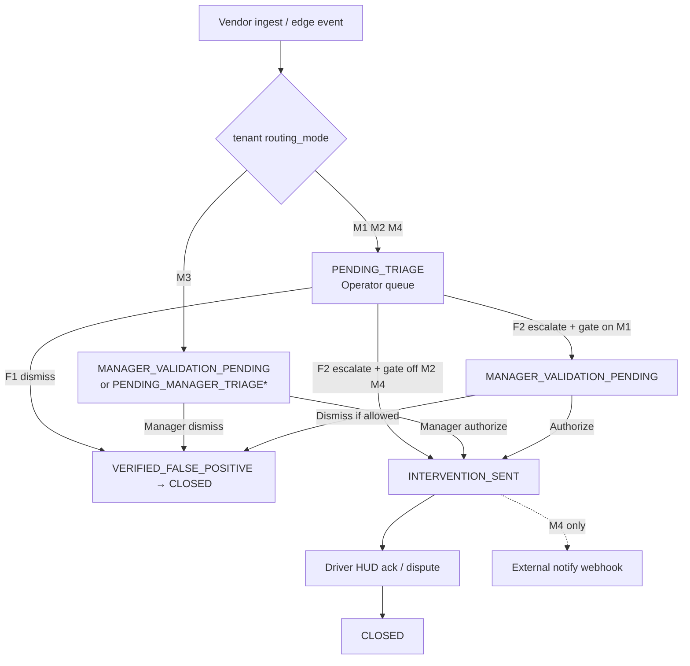

# Incident routing — building blocks assembly

**Status:** Architecture locked for planning · **Implementation blocked** on camera/telematics feed samples and per-customer call-handling contracts.

**Related:**

- [camera-risk-stream.md](./camera-risk-stream.md) — 15-minute assurance blocks (no acceptance workflow)
- [ADR 0003](../adr/0003-prospective-risk-engine.md) — assurance vs compliance
- `circadia-command/docs/MASTER_SPEC.md` — operator triage, lifecycle, manager gate
- `circadia-command/docs/SECTION_03_LIFECYCLE.md` — state machine

---

## 1. Purpose

Before wiring Streamax / VisionTrack (or any vendor), we need a single map of **what exists**, **who acts**, and **how tenant policy chooses the path**. This document is that map.

**Principle:** One incident ledger, multiple **entry queues** and **actor surfaces** — configured per tenant, not hard-coded globally.

---

## 1a. Why per-tenant setup is required (reminder)

Camera and incident workflows are **not one-size-fits-all**. Customers differ on who answers the phone, whether a supervisor must authorize action, and whether Circadia runs the desk at all. Hard-coding a single path (e.g. always operator → always manager) would block sales or force fleets into the wrong legal/operational model.

**Therefore:** routing and module flags are **per-tenant client setup**, set at onboarding from the worksheet (§6). The **building blocks** (pipelines, apps, lifecycle states) stay product-wide; only **assembly** varies.

### Who configures what

| Layer | Examples | Set by | Customer self-serve? |
|-------|----------|--------|----------------------|
| **Product (fixed)** | Three pipelines, lifecycle enum, `/manager` + `/manager/alerts` + Command `/triage`, bridge API shape, compliance engine | Circadia engineering | No — same for all tenants |
| **Per-tenant client setup** | Routing mode M1–M4, camera/incident module on/off, assurance-only vs live alerts, in-cab intervention on/off, manager dismiss policy, external webhook (M4), stationary suppress | Sales/onboarding worksheet → **tenant owner admin** (or Circadia ops on their behalf) | **One wizard / contract choice** — not a dozen conflicting toggles |
| **Circadia-internal ops** | Operator desk assignment, tenant UUID / identity sync, Command operator accounts, IP whitelist, vendor ingest credentials | Circadia ops / integration | No — fleet managers never see this |
| **Day-to-day use** | Open `/manager/alerts`, claim/act on queue | Fleet manager on duty | Use only — not policy |

### Prefer one routing choice, not raw flags

Expose customers something like **“How do you handle camera alerts?”**:

| Customer-facing option | Maps to | Derived behaviour |
|------------------------|---------|-------------------|
| Circadia desk, then our supervisor must approve | **M1** | Operator queue → `MANAGER_VALIDATION_PENDING` → `/manager/alerts` |
| Circadia desk only | **M2** | Operator queue → auto `INTERVENTION_SENT` |
| Our supervisor on phone | **M3** | Skip operator → manager inbox directly |
| Circadia desk, then our call centre | **M4** | Operator queue → webhook to customer SOC |
| Heatmap / coaching only, no live alert workflow | **B only** | `DriverRiskBlock` / fleet pulse; pipeline C off |

Do **not** expose `enforce_manager_gate`, operator vs manager queue, etc. as separate client switches — they follow from `routing_mode` (§4.2).

### Why this doc exists before build

Feed samples tell you **field mapping** (Phase 1), not **who acts on the call**. Both must be decided per pilot customer before ingest or `/manager/alerts` ship — otherwise you wire Streamax into the wrong queue and rework auth, UI, and audit expectations.

---

## 2. Building blocks inventory

### 2.1 Deployments (do not merge)

| Block | Package | URL (target) | Audience |
|-------|---------|--------------|----------|
| **Customer app** | `app-next/` | `fatigue-app-latest.vercel.app` | Drivers, fleet managers, tenant owners |
| **Command centre** | `circadia-command/` | `command.circadia24.com` | Circadia (or contracted) **operators** only |
| **FRMS engine** | `frms-engine/` | internal | TPMA maths for timeline scores |
| **Edge / vendor** | Streamax, Pi, etc. | vendor | Telemetry + optional clip URLs |

**Hard rule (MASTER_SPEC §1):** Command centre must not leak into driver/manager/owner routes in `app-next/`. Managers get a **thin bridge**, not the operator console.

### 2.2 Data paths (three separate pipelines)

These are **not** interchangeable. A vendor feed may feed one, two, or all three — that is discovered from sample payloads.

| Pipeline | Store | Question it answers | Human acceptance? |
|----------|-------|---------------------|-------------------|
| **A — Compliance** | Attested sheet / `compliance.ts` | Did the **signed record** breach law? | No (driver attestation only) |
| **B — Assurance / fleet pulse** | `DriverRiskBlock` | What is **relative fatigue exposure** in 15-min blocks? | No (coaching / glance only) |
| **C — Incident lifecycle** | `fatigue_incident_lifecycle` (+ `lifecycle_transition_log`) | Was this **camera/event** triaged, validated, and intervened? | **Yes** — operator and/or manager |

Pipeline **B** is documented in [camera-risk-stream.md](./camera-risk-stream.md).  
Pipeline **C** is documented in `circadia-command/`.  
**Direct video + accept/dismiss** always belongs to **C**, never to the heatmap alone.

### 2.3 Actor surfaces

| Actor | Auth | Surface | Sees |
|-------|------|---------|------|
| **Driver** | NextAuth `driver` | Driver sheet UI | Intervention HUD (future §10), not triage queues |
| **Fleet manager** | NextAuth `manager` | `app-next` `/manager/*` | Overview + **`/manager/alerts`** (planned) |
| **Command operator** | WebAuthn + IP whitelist | `circadia-command` `/triage` | Global `PENDING_TRIAGE` queue (all tenants they serve) |
| **External dispatcher** | *Not in-app today* | Webhook / email / customer SOC | Notifications only — optional escalation channel |

### 2.4 Pages (customer app)

| Route | Status | Device priority | Role |
|-------|--------|-----------------|------|
| `/manager` | **Shipped** | Desktop-first | Risk overview, compliance, records |
| `/manager/map`, `/manager/messages`, … | **Shipped** | Either | Supporting manager workflows |
| `/manager/alerts` | **Planned** | **Mobile-first** | Live incident inbox: video + manager validate/dismiss |

Managers on duty keep **`/manager/alerts`** open on a phone; desk work stays on `/manager`.

### 2.5 Command centre pages

| Route | Status | Role |
|-------|--------|------|
| `/triage` | Scaffolded | Operator queue + `MediaViewport` + F1/F2 |
| `/login` | Scaffolded | Operator WebAuthn |

### 2.6 APIs (bridge pattern)

Customer app must **not** expose Command DB to browsers. Planned bridge in `app-next` (requires explicit approval per MASTER_SPEC §10):

| Route | Direction | Purpose |
|-------|-----------|---------|
| `GET /api/frms/policy` | app-next → tenant config | Manager gate + routing mode for UI |
| `GET /api/frms/manager-incidents` | app-next → Command API | Queue for `/manager/alerts` (tenant-scoped) |
| `POST /api/frms/manager-callback` | app-next → Command API | `manager-validate` proxy with NextAuth session |

Command API (existing spec): `openapi/command-api-v1.yaml` — `/triage/queue`, `/triage/mutate`, `/triage/manager-validate`, `/driver/respond`.

### 2.7 Lifecycle states (pipeline C)

Canonical enum (`fatigue_incident_lifecycle.event_status`):

`PENDING_TRIAGE` · `VERIFIED_FALSE_POSITIVE` · `VERIFIED_TRUE_FATIGUE` · `MANAGER_VALIDATION_PENDING` · `INTERVENTION_SENT` · `DRIVER_ACKNOWLEDGED` · `DRIVER_DISPUTED` · `CLOSED`

Append-only audit: `lifecycle_transition_log`.

---

## 3. Tenant routing modes (customer choice)

How a fleet runs **calls** determines configuration — not product-wide defaults.

| Mode ID | Label | First human queue | Manager step | Typical customer |
|---------|-------|-------------------|--------------|------------------|
| **M1** | Operator + manager | Command `/triage` | **Required** (`enforce_manager_gate`) | Large fleet, formal FRMS, supervisor must authorize intervention |
| **M2** | Operator only | Command `/triage` | **Off** — auto `INTERVENTION_SENT` after operator escalate | Circadia runs desk; customer trusts operator SOP |
| **M3** | Manager only | **`/manager/alerts`** | Same person triages + validates | Small fleet, owner-supervisor on phone |
| **M4** | Operator + external handoff | Command `/triage` | **Off** in app; **notify** customer dispatcher on escalate | Customer has own 24/7 call centre; Circadia triages only |

**M4** does not require a third Circadia UI — only an **escalation channel** (webhook, email, SMS) when operator selects verified fatigue. The customer’s “somebody else” may never log into Circadia.

Future refinement (not required for v1): time-based routing (e.g. M3 by day, M1 after hours) — same machinery, policy schedule overlay.

### 3.1 Mode → state entry diagram

\* `PENDING_MANAGER_TRIAGE` is an optional future status for cleaner reporting when M3 skips operators entirely. v1 may reuse `MANAGER_VALIDATION_PENDING` with `actor_type` / routing metadata in the transition log.

---

## 4. Configuration model

### 4.1 Already in schema (`tenant_compliance_policy_overrides`)

| Field | Effect today |
|-------|----------------|
| `enforce_manager_gate` | Operator F2 → `MANAGER_VALIDATION_PENDING` instead of `INTERVENTION_SENT` |
| `allow_manager_override_dismissal` | Manager may dismiss from `MANAGER_VALIDATION_PENDING` |

Maps to **M1** vs **M2** when ingest always enters operator queue.

### 4.2 Proposed (lock before implement — not in DB yet)

| Field | Type | Purpose |
|-------|------|---------|
| `routing_mode` | enum `M1` \| `M2` \| `M3` \| `M4` | Primary assembly selector (§3) |
| `external_escalation_webhook_url` | string? | M4 — POST on `VERIFIED_TRUE_FATIGUE` |
| `external_escalation_enabled` | boolean | Kill switch per tenant |
| `manager_alerts_enabled` | boolean | Show `/manager/alerts` nav + bridge APIs |
| `ingest_suppress_stationary` | boolean | Default true per MASTER_SPEC §11 — 0 km/h suppress |

**M3** implies `routing_mode = M3` and ingest creates manager-queue incidents (skip `PENDING_TRIAGE`).

**M1** implies `routing_mode = M1` and `enforce_manager_gate = true`.

### 4.3 Hardware provision hook

Edge devices read policy at provision time (`GET /hardware/provision` in Command spec): `frms_policy_toggle_manager_gate` aligns Pi behaviour with tenant gate. Streamax mapping TBD from feed samples.

---

## 5. How video fits each pipeline

| Feed characteristic | Likely pipeline | UI |
|--------------------|-----------------|-----|
| Rolling scores every N minutes, no clip | **B** → `DriverRiskBlock` | Fleet pulse / individual chart |
| Discrete alarm + `video_url` / clip id | **C** → lifecycle | Operator and/or `/manager/alerts` |
| Both in one vendor stream | **B + C** | Heatmap **and** alerts — same driver, different stores |

**Blocked on insider samples:** field names, URL lifetime, auth headers, device→driver mapping, alarm types vs metrics.

Until samples exist: **do not** implement ingest routes or UI beyond stubs.

---

## 5a. FTCloud discovery checklist (first-hop reminder)

If **FTCloud** is the first hop from the Streamax device, then FTCloud is likely the **integration surface** we need to understand first, not the camera hardware itself.

Use this checklist in the next insider / vendor conversation:

### Transport and delivery

1. Does FTCloud **push** events to us (webhook), or do we **poll** an API?
2. If polling, what is the endpoint for **new / unprocessed alerts**?
3. What auth is required: API key, bearer token, IP allowlist, signed webhook, or session login?
4. Are there sandbox credentials or a tenant we can safely test against?

### Event payload shape

1. Can we get one **real sample JSON payload** for a fatigue / distraction / eyes-closed alert?
2. Is each alert a **discrete incident**, a rolling metric, or both?
3. What timestamps are included: detected time, upload time, event start/end, timezone?
4. What event identifiers exist: event ID, device ID, vehicle rego, trip ID, driver ID?
5. Is there a confidence score, severity band, alarm type, or vendor status code?

### Video / media access

1. Are clips exposed as **direct URLs**, expiring URLs, HLS streams, or a separate download endpoint?
2. How long do clip URLs remain valid?
3. Does video require extra auth headers/cookies, or is the URL itself sufficient?
4. Can we request multiple clip lengths / resolutions, or is there one fixed asset?
5. Is there also a still image / thumbnail URL for queue previews?

### Identity mapping

1. Can FTCloud tell us the **driver**, or only the **device / vehicle**?
2. If only vehicle/device, what stable field maps to our fleet records: rego, serial number, IMEI, unit ID?
3. Can the same device move between vehicles or drivers?
4. Is there a fleet admin screen or export where device-to-vehicle mappings are managed?

### Lifecycle / acknowledgment

1. Does FTCloud already have its own **acknowledge / close / reviewed** workflow?
2. If yes, are we expected to write status **back** to FTCloud, or can Circadia run an independent lifecycle?
3. Can we safely treat FTCloud as **read-only ingress**, with our own `fatigue_incident_lifecycle` as source of truth for operator/manager actions?
4. Are duplicate deliveries possible, and what field should we use for idempotency?

### Product-routing implications

1. Which payloads feed **pipeline B** (`DriverRiskBlock` / fleet pulse)?
2. Which payloads feed **pipeline C** (`fatigue_incident_lifecycle` / accept-dismiss workflow)?
3. Are there customers who want **assurance-only** with no live alert workflow?
4. For the pilot customer, which routing mode applies: **M1**, **M2**, **M3**, or **M4**?

### Minimum artifact to unblock Phase 1

Phase 1 feed mapping is unblocked once we have:

- one real FTCloud event payload
- one real video/clip access example
- the stable identity fields we can map to driver / rego / device
- the auth method
- confirmation whether FTCloud is **push** or **poll**

Without those five items, do not implement ingest routes or manager alert playback.

**Source doc on file:** `Events-Platform-User-Guide-20231011.pdf` (VisionTrack / FTCloud-style Events Platform user guide, Oct 2023). Confirms cloud-first integration surface; does **not** replace API/integration contract.

---

## 5b. Events Platform user guide — implications for Circadia

Reviewed against *Events Platform User Guide* (version 20231011.32). This is **operator UI documentation**, not wire-format spec — but it validates several assembly assumptions and raises one strategic fork.

### What the guide confirms

| Topic | Events Platform behaviour | Circadia implication |
|-------|---------------------------|----------------------|
| **First hop** | Cloud captures video + telematics; hardware-agnostic ingest | Integrate at **Events Platform / FTCloud**, not in-vehicle device API |
| **Discrete events** | Events tab: filters, map, AI analysis, event notes | Maps to **pipeline C** (lifecycle), not fleet pulse alone |
| **Identity** | Search by **VRN** or **device ID**; driver name or custom vehicle property | Map ingest → rego + device + optional driver in Circadia roster |
| **Human triage** | Roles include **Event Viewer**; events designed for monitoring staff | Parallel to **circadia-command** `/triage` — not the fleet manager desk overview |
| **Native statuses** | Not Processed · Incident · Dismissed · Footage Requested · Requires Intervention | Similar intent to our lifecycle; see integration model below |
| **Issue categories** | Device Issue · Driver Issue · **False Positive** · Other | Operator dismiss / manager override language already exists in vendor UX |
| **Video timing** | Not all red events auto-download video; manual request; media Queued/Sent/Unavailable; overwrite within days | **Manager alerts UI must tolerate video-pending** — show event first, clip when ready |
| **Notifications** | Fleet/vehicle email alerts with **link back to event in platform** | Compare with Circadia `/manager/alerts` or tokenized deep link (§9) |
| **Integration path** | Organisation → **Integration Details** (requires integration licence; contact Technical Support) | Insider must obtain this screen / docs — not in user guide body |

### What the guide does not provide

- REST/webhook endpoints, auth headers, JSON schemas
- Whether external systems can **create or update** event notes/status
- Programmatic media URL vs authenticated portal-only playback
- Idempotency keys or event IDs for ingest deduplication

Phase 1 remains blocked until **Integration Details** + sample payloads are supplied (§5a).

### Strategic fork: who owns event processing?

The Events Platform already **processes** events (notes remove items from “Needs Review”). Circadia must pick a model per customer:

| Model | Description | When to use |
|-------|-------------|-------------|
| **A — Circadia primary** | Ingest → `fatigue_incident_lifecycle`; operator/manager act in Circadia; optional status sync back to Events Platform | M1–M3 customers replacing or augmenting Event Viewer workflow |
| **B — Events Platform primary** | Circadia read-only ingest for FRMS/compliance context; customer keeps processing in vendor UI | Transition / assurance-only pilots |
| **C — Dual write** | Both systems show queue; status must stay in sync | Avoid unless vendor API supports write-back — high complexity |

**Default recommendation:** **Model A** for routed tenants (M1–M4); treat Events Platform as **ingress + media source** until write-back API is proven. Lock per pilot in §6 worksheet item 9.

### UI design reminders from vendor UX

1. **Event card** should show: VRN, time, classification, map pin, status, video state (ready / pending / unavailable).
2. **Do not assume clip on alert** — mirror “Request Video” / media queue behaviour in empty states.
3. **False positive dismiss** is a first-class vendor category — align operator F1 copy with vendor language where helpful.
4. **Share event link** (60-day external access) is vendor-native — Circadia tokenized `/critical/[eventId]` (§9) is optional enhancement, not required for v1.

### Copy-paste vendor request

Ready-to-send email and checklist for Technical Support / integration team: **[events-platform-vendor-request.md](./events-platform-vendor-request.md)**.

---

## 6. Assembly checklist (per tenant go-live)

Use this as a sales/ops worksheet before enabling camera integration:

1. **Routing mode** — M1 / M2 / M3 / M4?
2. **Manager gate** — required authorize before driver intervention? (M1 yes, M2/M4 no, M3 N/A)
3. **Manager dismiss** — `allow_manager_override_dismissal`?
4. **Who is on call** — named managers vs roster (future); mobile number for SMS fallback?
5. **Operator desk** — Circadia 24/7 or customer self-serve (M3)?
6. **External handoff** — M4 webhook URL and payload format?
7. **Assurance-only** — fleet pulse without lifecycle (pipeline B only)?
8. **Intervention** — in-cab HUD enabled or alerts for coaching only?
9. **Integration model** — Circadia primary (A), Events Platform primary (B), or dual (C)? See §5b.

---

## 7. Implementation phases (strict order)

| Phase | Depends on | Deliverable |
|-------|------------|-------------|
| **0 — This doc** | — | Assembly agreement |
| **1 — Feed mapping** | Vendor JSON + clip URL sample | Ingest mapper spec (which pipeline, which fields) |
| **2 — Policy API** | Phase 1 + tenant contract | `routing_mode` storage + `GET /api/frms/policy` |
| **3 — Manager alerts** | Phase 2, M1 or M3 | `/manager/alerts` + bridge routes (approval gate) |
| **4 — Operator triage** | Phase 1, M1/M2/M4 | Command ingest + `/triage` production |
| **5 — Driver intervention** | Phase 3–4 + HUD approval | WebSocket HUD, `/driver/respond` |
| **6 — External handoff** | M4 customers | Webhook on escalate |

**Do not start Phase 3+ until Phase 1 mapping doc is signed off for at least one pilot tenant.**

---

## 8. Approval gates

| Change | Gate |
|--------|------|
| New manager routes (`/manager/alerts`, FRMS bridge APIs) | Explicit approval — MASTER_SPEC §10, `.cursor/rules/fatigue-ui-approval.mdc` |
| Lifecycle state enum changes | Architecture + compliance review |
| Compliance rule modules | Owner approval — `.cursor/rules/time-rules-ip.mdc` |
| Operator auth / IP whitelist | Security review |

---

## 9. Open decisions (resolve with first pilot customer)

1. **M3 entry status** — reuse `MANAGER_VALIDATION_PENDING` vs new `PENDING_MANAGER_TRIAGE`.
2. **Push notifications** — polling/SSE enough for v1, or mobile push required for after-hours?
3. **Multi-manager claim** — first-claim-wins (like operator `claim`) vs broadcast to all managers?
4. **Assurance + incident link** — show heatmap context on alert card, or keep inbox minimal?
5. **Autonomise vs Streamax direct** — single ingest adapter vs two; does not change assembly, only mapper.

---

## 10. Summary

- **Three pipelines** — compliance, assurance blocks, incident lifecycle — stay separate.
- **Two human UIs** — Command (operator), Manager Alerts (fleet manager) — same ledger, different queues.
- **Four routing modes** — M1–M4 — per-tenant, driven by how the customer runs calls.
- **Feed samples** unlock ingest mapping only; they do not change this assembly.
- **Next concrete step:** insider payload → Phase 1 mapping doc → pick pilot `routing_mode` → then build bridge + alerts.

---

## Changelog

| Date | Note |
|------|------|
| 2026-06-20 | §5b Events Platform user guide implications; §6 item 9 integration model; vendor request doc |
| 2026-06-18 | §5a FTCloud discovery checklist |
| 2026-06-18 | §1a — per-tenant setup rationale, who configures what, wizard vs raw flags |
| 2026-06-18 | Initial assembly spec — planning lock before Streamax integration |
