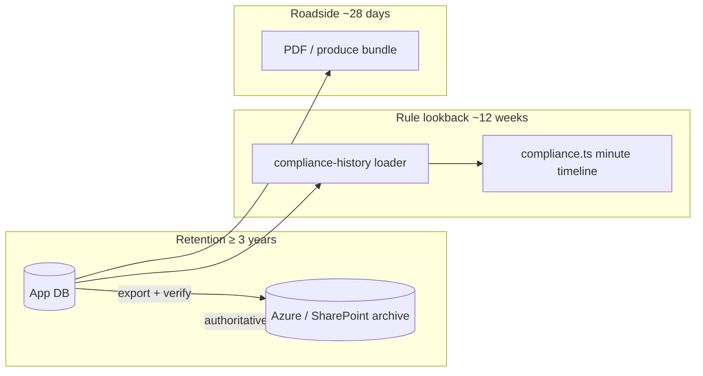

# Record retention vs compliance lookback

**Status:** Ongoing product reference  
**Last reviewed:** 2026-06-02  
**Audience:** Product, engineering, compliance, archive/ops

> **Disclaimer:** This document summarises legislative requirements for product design. It is **not legal advice**. Confirm obligations with qualified counsel and current official sources before changing retention, export, or purge behaviour.

## Why this document exists

Fatigue law uses **three different time horizons** that are easy to conflate:

| Concept | Typical horizon | Question it answers |
|--------|-----------------|---------------------|
| **Record retention** | **≥ 3 years** | How long must the **record keeper** keep work-time records? |
| **Rule lookback** | **14–28 days** (+ shorter windows) | How much **past activity** does a **compliance rule** need to evaluate? |
| **Roadside produce** | **28 days** (NHVR work diary) | What must a driver **carry / produce at roadside**? |

Circadia must implement each horizon for a **different purpose**. Mixing them leads to incorrect purge policy, under-scoped rule checks, or misleading manager copy.

---

## 1. Record retention (system of record)

The **record keeper** (employer / operator / accredited entity, depending on jurisdiction and arrangement) must retain fatigue-related records for **at least three years**.

### Western Australia — WHS (General) Regulations 2022

- **Reg 184G — Record keeping for commercial vehicle drivers**
- Records must cover **work time, breaks from driving, and non-work time**.
- Must be kept for **at least 3 years from the date of the last entry** in the record.
- Must be **clear, systematic, and accessible** to an inspector on request.

**Primary mapping in Circadia:** weekly sheet + event timeline + exports (PDF / archive bundle) constitute the retained record. The app (or integrated archive) is the retention mechanism unless another system is designated as authoritative.

**Related app doc:** [WA commercial vehicle driver hours](./wa-commercial-vehicle-hours.md) (rule math under Reg 184E).

### NHVR / HVNL (national heavy vehicle)

- **Heavy Vehicle National Law — s 341** (record keeping)
- Records must be kept for **3 years** after the record is **made or received**.
- Must remain **readable and accessible** for that period.

Official guidance: [NHVR — Record keeping requirements](https://www.nhvr.gov.au/safety-accreditation-compliance/fatigue-management/record-keeping-requirements).

**Primary mapping in Circadia:** same weekly record + exports; national rollout must satisfy s 341 even when WA Reg 184G is the rule-set source for time limits.

### Product constants (retention policy)

Defined in `src/lib/record-retention.ts`:

| Constant | Value | Meaning |
|----------|-------|---------|
| `RECORD_RETENTION_YEARS` | `3` | Minimum retention period aligned with WA Reg 184G and HVNL s 341 |
| `RECORD_RETENTION_WEEKS` | `156` | Approximate week count for scheduling (`3 × 52`); use calendar-year logic where precision matters |

**Policy implication:** Do **not** permanently delete records from the authoritative store before **3 years from the last entry** (or 3 years from receipt, per s 341), unless a **separate archive** (e.g. Azure Blob + manifest) is provably the system of record and the app DB is only a short-lived operational cache.

---

## 2. Compliance rule lookback (operational, not retention)

Rule engines evaluate **rolling windows** over recent activity. These windows are **not** retention requirements.

### WA Reg 184E — windows used in `compliance.ts`

| Rule area | Window | App behaviour |
|-----------|--------|---------------|
| 5-hour breaks | Rolling 5h work | Violation / break qualification |
| 168h work cap | 14-day periods within 48h-reset segments | Violation (+ warning at 140h) |
| Solo 72h non-work | 72h ending now | Warning |
| Solo 14-day 24h non-work | 14 days | Violation at timeline end; rolling audit → warning |
| Solo 28-day pattern (4×24h) | 28 days | Not fully implemented |
| Two-up 24h / 48h / 7-day | 24h–7d rolling | Violation / warning |
| Shiftwork A↔B | 5+ consecutive days | Violation on pattern change |

These windows need **enough historical data loaded into memory** to evaluate the rule at “now” or at sheet submit time — typically **up to 28 days** for solo 28-day logic, plus **168h / 48h reset context** which may require prior weeks beyond a flat 28-day slice.

### Product constant (rule-engine lookback)

Defined in `src/lib/compliance-history.ts`:

| Constant | Value | Meaning |
|----------|-------|---------|
| `COMPLIANCE_PRIOR_WEEKS_LOOKBACK` | `12` | Weeks of **prior** submitted sheets loaded for rule math (28-day rules, rolling solo audit, 168h context). **Excludes** the current in-progress week. |

**This is not a retention standard.** Twelve weeks (~84 days) is an engineering choice that comfortably covers 28-day rules and 168h segmentation with margin. It can be tuned for performance without changing legal retention.

**Current wiring:**

- `loadComplianceWeekContext` / `GET /api/sheets/[id]/compliance-history`
- Manager compliance snapshot (per-driver history from DB)
- `runComplianceChecks` minute-timeline paths

**Known gap (parked):** A **full lifetime scanner** — evaluating every possible 14/28-day window across the entire **3-year retained record** — is not implemented. It is computationally heavy and depends on retention + archive being in place first.

---

## 3. Roadside produce (driver-facing, not storage)

Under NHVR **work diary** rules (e.g. **s 293** — production of records), a driver may need to **produce** records covering roughly the **last 28 days** at roadside. That obligation applies to **what is carried or immediately producible**, not to how long the operator must retain records in the back office.

**Circadia mapping:**

- PDF / export flows: [roadside PDF architecture](../architecture/roadside-pdf-s6.md)
- **28-day produce ≠ 3-year retention ≠ 12-week rule lookback**

---

## 4. Architecture principles (Circadia)

1. **Rolling minute timeline** is the source of truth for rule mathematics.
2. **Weekly sheet** is the legal attestation slice (driver sign-off for that week).
3. **Record** (what happened) and **rules** (whether limits were met) are separate concerns — see `product-copy.ts` / manager risk framing.
4. **Retention** protects the business for audits and disputes; **lookback** powers real-time and weekly compliance checks; **roadside produce** satisfies immediate inspection needs.

---

## 5. Archive, export, and purge

Design note: [WEEKLY_ARCHIVE_EXPORT.md](../WEEKLY_ARCHIVE_EXPORT.md) originally proposed **~1 week in DB then purge**. That pattern is valid only if:

1. **Export succeeds** and is verified (checksum / manifest).
2. The **archive destination** is the **authoritative system of record** for the full **3-year** period.
3. Purge from the app DB does **not** delete the only copy before retention expires.
4. Records remain **identifiable, readable, and inspector-accessible** at the archive (index + PDF per sheet).

**Recommended policy alignment:**

| Layer | Retention | Role |
|-------|-----------|------|
| App DB (operational) | Short (e.g. 1–4 weeks) optional | Fast queries, compliance lookback, manager views |
| Archive (Blob / SharePoint) | **≥ 3 years** | Legal retention, audit, dispute |
| Compliance engine | **12 prior weeks** loaded from DB | Rule evaluation at submit / manager snapshot |

If the app DB is the **only** store, purge must **not** use a 1-week window — use **`RECORD_RETENTION_YEARS`** instead.

---

## 6. Manager and UX copy

Manager surfaces should frame **risk and assurance**, not imply that “we only keep 12 weeks of records.” Where lookback limits affect what the dashboard can **evaluate**, say so explicitly (e.g. “compliance signals based on the last N weeks of loaded history”), without conflating that with legal retention.

---

## 7. Checklist for future changes

Before changing purge, export, or lookback constants:

- [ ] Does purge respect **3-year** retention (or verified archive as SOR)?
- [ ] Does reducing `COMPLIANCE_PRIOR_WEEKS_LOOKBACK` break **28-day** or **168h/48h reset** checks?
- [ ] Does manager copy distinguish **evaluation window** from **record retention**?
- [ ] Are WA Reg 184G and HVNL s 341 both satisfied for national deployments?
- [ ] Is roadside **28-day produce** still available independently of DB purge?

---

## Related documents

| Document | Topic |
|----------|--------|
| [wa-commercial-vehicle-hours.md](./wa-commercial-vehicle-hours.md) | Reg 184E rule mapping → `compliance.ts` |
| [WEEKLY_ARCHIVE_EXPORT.md](../WEEKLY_ARCHIVE_EXPORT.md) | Export format and scheduling |
| [0001-multi-jurisdiction-fatigue-architecture.md](../adr/0001-multi-jurisdiction-fatigue-architecture.md) | Jurisdiction / EWD positioning |
| [roadside-pdf-s6.md](../architecture/roadside-pdf-s6.md) | Roadside produce |
| `src/lib/record-retention.ts` | Retention constants |
| `src/lib/compliance-history.ts` | Rule-engine history loader |
| `GET /api/sheets/[id]/compliance-history` | Returns `policy` + history for sheet compliance |
| `GET /api/manager/compliance` | Returns `policy` + fleet assurance inputs |
| `CompliancePolicyFootnote` | Driver/manager UI footnote (CompliancePanel, assurance signals) |
| Driver help · Records | `DRIVER_HELP_RETENTION_BULLETS` |
| Manager reference library | “Retention vs rule lookback” card |

---

## Revision log

| Date | Change |
|------|--------|
| 2026-06-02 | Initial reference: 3-year retention (WA 184G, HVNL s 341), 12-week lookback, archive alignment |
