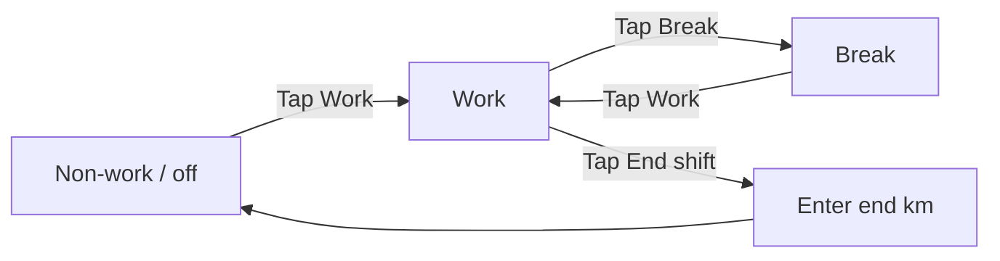

# Driver UI guide (simple English)

**For:** Drivers who use Circadia 24 on a phone or tablet.  
**Language:** Short sentences. Common words. Pictures and diagrams below.

---

## 1. What this app does

Circadia 24 keeps your **weekly fatigue record**.

- You tap buttons when you **work**, **break**, or **end shift**.
- Time you do not log is shown as **non-work** (rest / off duty).
- Each **week** (Sunday to Saturday) is one record. You **sign** the week when it is correct.

This guide is **not** legal advice. Your company and WA rules still apply.

---

## 2. Sign in

1. Open the app in your browser.
2. Type your **email** (from your manager).
3. Type your **password** (from your manager).
4. Tap **Sign in**.

```
┌─────────────────────────────┐
│  Email:  you@company.com    │
│  Password: ••••••            │
│         [ Sign in ]         │
└─────────────────────────────┘
```

---

## 3. Home screen (“Drive home”)

After sign in you see **Drive home**.

| On screen | Meaning |
|-----------|---------|
| Your name | You are signed in |
| Today / This week | Which day and week you are in |
| **Continue logging** (green button) | Open **this week** to log work |

```
┌─────────────────────────────┐
│  ◀  Circadia 24      ⚙      │
│  Hello, [Your name]         │
│  Today: Wednesday           │
│  Week: 1 Jun 2026           │
│                             │
│  ┌─────────────────────┐    │
│  │ Continue logging  ▶ │    │
│  └─────────────────────┘    │
│  Your weeks              ▶  │
└─────────────────────────────┘
```

**Tip:** Use **Continue logging** every day when you start work.

---

## 4. The log bar (main buttons)

At the top of **this week** you see three big buttons:

| Button | When to tap |
|--------|-------------|
| **Work** (or **Start shift**) | You start driving / working |
| **Break** | Short rest during work (≤ 30 minutes) |
| **End shift** | You finish work for this shift |

```
┌─────────────────────────────┐
│  [ Work ] [ Break ] [ End ] │
│         shift               │
└─────────────────────────────┘
```

### Activity flow (diagram)



**Simple rule:** Tap the button that matches **what you are doing now**.

---

## 5. Non-work time

- If you do **not** tap Work or Break, the app shows **non-work**.
- Long rest (**more than 30 minutes**) is **non-work**, not Break.
- **Break** is for short rest during work.

When you stop working for the day, tap **End shift**. After that, time is non-work until you tap Work again.

---

## 6. End shift and kilometres (km)

When you tap **End shift**:

1. The app may ask for **end km** on the odometer.
2. Enter the number if you can.
3. Confirm.

**Why:** Your record matches the truck’s distance.

If you **forget** End shift:

- The app may show a reminder.
- You may see **Mark non-work from now** or ask your manager.
- If **yesterday** was not ended, a banner may say to **end yesterday at last log time**.

---

## 7. Day card (route details)

Scroll down to **today’s day card**. You may need:

| Field | What to enter |
|-------|----------------|
| **Rego** | Truck number plate |
| **Destination** | Where you are going |
| **Start km** | Odometer at start (if asked) |

Fill these **before** or when you **Start shift** if the app asks.

```
┌─────────────────────────────┐
│  Wednesday 3 Jun            │
│  Rego: [ 1ABC123 ]            │
│  To:   [ Perth depot ]        │
│  Start km: [ 125400 ]         │
│  Events: Work 06:00 …         │
└─────────────────────────────┘
```

---

## 8. Two drivers (two-up)

If your sheet has **two drivers**:

- You may see **Primary** and **Second**.
- Choose your name before you tap Work / Break.
- Each driver logs their own events.

---

## 9. Sign your week

When the week is finished and correct:

1. Open **this week** (or the week from **Your weeks**).
2. Read each day.
3. Tap **Sign** (or **Sign this week’s record**).
4. Your **signature** means: “This record is true.”

```
┌─────────────────────────────┐
│  Sign this week's record    │
│  Review days below, then    │
│  sign when correct.         │
│         [ Sign ]            │
└─────────────────────────────┘
```

**After you sign:**

- That week is **locked** for you.
- If something is wrong, **talk to your manager**. They can fix with a reason. You **sign again**.

**Past weeks not signed:** You can still open them and sign. They do not block logging on **this week**.

---

## 10. Your weeks (list)

Menu: **Your weeks** (`/sheets`)

| Label you may see | Meaning |
|-------------------|---------|
| Current week | Log Work / Break / End shift here |
| Unsigned past week | Open, fix, then sign |
| Signed | Locked — read only for you |

---

## 11. Messages and settings

| Place | Use |
|-------|-----|
| **Settings** (gear icon) | Help, messages, sign out |
| **How your record works** | Short help inside the app |
| **Full guide with pictures** | This guide in the app |
| **Messages** | Talk to your manager |

---

## 12. Commercial Driver's Medical (reminder)

If your manager saved a **medical expiry date** for you:

- You may see a **yellow** or **red** banner on your sheet.
- Book your medical and tell your manager to update the date in **Approved Drivers**.

---

## 13. Quick checklist (each day)

1. Sign in  
2. **Continue logging**  
3. Fill **rego / destination / km** if needed  
4. Tap **Work** when you start  
5. Tap **Break** for short rest  
6. Tap **End shift** when you finish (+ end km)  
7. At end of week: **Sign**

---

## 14. Words you may see (glossary)

| Word | Simple meaning |
|------|----------------|
| **Work** | Driving or on-duty work |
| **Break** | Short rest (≤ 30 min) during work |
| **Non-work** | Off duty / long rest / sleep |
| **End shift** | Finished work for this shift |
| **Week** | Sunday–Saturday record |
| **Sign** | You agree the week is correct |
| **Rego** | Number plate |
| **km** | Kilometres on the odometer |
| **Sheet** | One week’s record |

---

## 15. Need help?

- Read **Settings → How your record works** in the app.  
- Ask your **manager**.  
- This file: `docs/user-guides/driver-ui-guide-esl.md`
