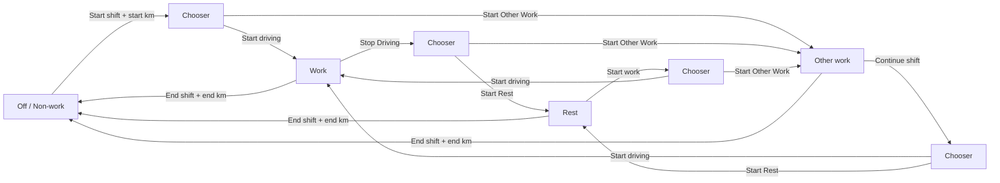

# Driver guide — Circadia24 EWD (simple English)

**For:** Drivers using the Circadia24 EWD app on a phone or tablet.

This guide explains how to use the app. It is **not** legal advice. Your company rules and WA commercial vehicle hours still apply.

---

## 1. What this app does

Circadia24 keeps your **weekly fatigue record** — an electronic work diary (EWD).

- You tap buttons when you **work**, **stop driving** (then rest or other work), or **end shift**.
- Time you do not log is counted as **non-work** (rest / off duty) — like blank time on a paper diary.
- If you drive the **same route often**, the app can **suggest** rego and run plan in **Set up day** from your last trip. They appear on the day sheet and PDF only after you **Confirm**. **Start location** and **destination** only appear under **Enter run plan** (blank when you open that option), or from a **Saved run plan** you pick. You always type **start km** and **end km** yourself.

---

## 2. Sign in

1. Open the app in your browser (or the installed app).
2. Type your **email** (provided or from your manager).
3. Type your **password** (provided or from your manager).
4. Tap **Sign in**.
5. If you forgot your password, tap **Forgot password?**, enter your email, and use the reset link we send (when email is set up). Or ask your manager to set a new temporary password.

You can change your password later in **Settings → Account → Change password**.

---

## 3. Drive home (the first screen)

After sign in you see **Drive**.

| On screen | Meaning |
|-----------|---------|
| Hi, [your name] | You are signed in |
| This week · [date] · Today · [date] | Which week and day you are in |
| Status card (Work / Break / Off) | What the app thinks you are doing now |
| **Log more work / Open this week** (green) | Open this week to log |
| **Produce 28 day roadside PDF** (amber) | One PDF for a regulator |
| **Your weeks** | Past and signed records |
| ⚙ (top right) | Settings and tools |

**Tip:** Tap **Log more work** each day when you start.

---

## 4. The log bar (main buttons)

At the top of **this week** you see big buttons. The buttons change to match what you are doing:

| Button | When it shows / what to tap |
|--------|------------------------------|
| **Start shift** | Opens Set up day if details are missing, then Start driving or Start Other Work. Does not log by itself |
| **Start work** | On Rest: choose Start driving or Start Other Work (loading). Does not log by itself |
| **Start driving** | Top of the Start shift / Start work / Continue shift split. Starts driving on the timeline |
| **Continue shift** | On Other work: choose Start driving or Start Rest. Does not log by itself |
| **Stop Driving** | You have stopped driving. Still on shift. Not End shift. Opens the split. |
| **Start Rest** | Sit still — eat, drink, nap. 31 minutes or more becomes non-work. Top of Stop Driving, or bottom of Continue shift |
| **Taking a nap?** | Bottom-left, only while on Rest. Not in the hero. Tap once if you are napping — still Rest on the record. Compact: **Nap?**. After tap: **On nap** (tap again to clear). |
| **Start Other Work** | Bottom of Start shift / Start work / Stop Driving. Not driving, still a job — load, forklift, tyre, paperwork, fuel. After tap-again, choose **Load check** or **Not a load** |
| **End shift** | You finish work — enter finish time and end km |

```
┌─────────────────────────────┐
│ [ Start shift ]             │
│ [ Start work ]              │
│   then split:               │
│ [ Start driving ]           │
│ [ Start Other Work ]        │
│ [ Continue shift ]          │
│   then split:               │
│ [ Start driving ]           │
│ [ Start Rest ]              │
│ [ Stop Driving ]            │
│   then split:               │
│ [ Start Rest ]              │
│ [ Start Other Work ]        │
│ [ Taking a nap? ] [ End shift ] │
└─────────────────────────────┘
```

### Activity flow



**Simple rule:** Tap the button that matches **what you are doing now**. The timer under the ring has a small note — **(Work)**, **(Rest)**, or **(Other work)** — so Start Rest is not confused with Other work. Then **tap again within a few seconds** when the button pulses — that second tap is what records the event (Start driving, Start Rest, Start Other Work, End shift). **Start shift**, **Start work**, **Continue shift**, and **Stop Driving** only open a split — they do not log until you pick a kind.

While you are on **Rest**, a corner control asks **Taking a nap?** It is not in the hero split. Tap it only if you are napping — the record stays Rest. It then shows **On nap**. Tap again to clear.

**While the vehicle is moving** (when your organisation has the GPS trail addon on): Start shift / Stop Driving / End shift stay locked but you still see the usual timer and labels (dimmed), with **Moving · pull over to unlock** and a ring that fills while you are stopped. Pull over and wait a few seconds — then tap. If you already tapped once to confirm, the second tap still works. **View diary** stays available.

You **cannot** start a shift until **start km** is on today's card (see section 7).

---

## 5. Non-work time

- If you do **not** tap Start driving, Start Rest, or Other work, the app shows **non-work**.
- **Rest** only appears when you tap **Start Rest**. A short logged rest (30 minutes or less) stays Rest; longer logged rest (31 minutes or more) becomes **non-work**.
- **Other work** is a break from driving on the sheet. It never becomes **non-work**, even if it is long (a loading job is not off the job).
- For the **20 min rest per 5 hours work** rule, Rest, Other work, and Non-work all count. Other work is still work time for the 168h limit.
- The app does **not** invent Rest from a short gap after **End shift** or other time off.
- When you finish for the day, tap **End shift**. From that moment, time is **non-work** until you tap **Start shift** again.

---

## 6. End shift and kilometres (km)

When you tap **End shift**:

1. The app asks **when you finished** and your **end km**.
2. If your last Work/Break was on an **earlier day** (for example you forgot to end last night), choose the **finish date** — from when you **started that shift** through today — then the finish time. Work that **continues onto today on the bar** without a new tap is still the same shift; it does not lock End shift to today.
3. Read the odometer and type the end km.
4. Confirm.

**Important:** The app **never** fills in start km or end km. You always read the truck and type them.

**If your shift runs past midnight:** just keep working. Your open work **continues across midnight** on the same timeline. There is **no** separate "end yesterday" step while you are still working — tap **End shift** only when you actually finish. Day cards are just labels; they do not end your shift.

**If you forget End shift:** the app may show a short reminder (for example after a long stretch with no new log). Use the red **End shift** button, pick the **date and time you actually finished** (not only today's clock), and enter end km.

---

## 7. Today's card — repeat routes (most days)

Many drivers use the **same rego and route** every day. The app can **suggest** those values in **Set up day** — they do **not** appear on the WorkSafe day sheet or PDF until you **Confirm**.

| Field | Suggested in Set up day? | On sheet / PDF without Confirm? |
|-------|--------------------------|----------------------------------|
| **Rego** (number plate) | Yes — from last trip or earlier this week | **No** |
| **From** / **To** | Yes (Enter run plan or Saved run plan) | **No** |
| **Run plan** (name, hours, distance) | Yes, if you used it before | **No** until Confirm |
| **Start km** | **No — you type this every day** | Only after you enter it |
| **End km** | **No — you type this at End shift** | Only after you enter it |

```
┌─────────────────────────────┐
│  Wednesday                  │
│  Rego / From / To: blank    │
│  until Set up day Confirm   │
│                             │
│  Start km (required):       │
│  [ _________ ]  ← you type  │
│                             │
│  WorkSafe day sheet         │
│  (15-min tick grid · work / │
│   break / non-work)         │
└─────────────────────────────┘
```

          Under the route fields, the day card shows a **WorkSafe WA day sheet** like the paper log: truck reg, odometer and locations across the top, then three rows (**WORK TIME**, **BREAKS FROM DRIVING**, **NON WORK TIME**) with a **15-minute tick grid** (blank first hour, then 1.00–23.00), weekday and date in the corner, and a thin **step line** showing what you logged (same rules as section 5). Days with **no events** show a full **non-work** line (totals Work 0 / Break 0 / Non-work 24) — no blank unfinished rows. On a phone you can scroll the sheet sideways.

**Normal day:** open the week → tap **Start shift** → if day setup is needed, complete Set up day and **Confirm**, then choose **Start driving** or **Start Other Work** on the ring → or if setup is already done, the same split opens (tap again to confirm the kind). After **Start Other Work** is logged, the ring asks **Load check** or **Not a load**. Load check opens Dimension & Load; you stay on Other work. While still on Other work, **Add load check** under the ring starts another load form. **Daily checks** on the day card stay available (Fitness for work, Daily vehicle checklist, Dimension & load) for depot / already-loaded work. Forms are optional in trial — do **not** block Start shift.

### Set up day / Edit day

Use **Set up day** (or **Edit day**) when something changes:

- New truck (rego)
- New run — **Saved run plan**, **Enter run plan** (from / to, name, expected hours/km), or **No run plan**
- **Shift pattern** — Day (A) or Night (B)
- **Solo** or **Two-up**, and the **relief driver's name**
- **Last 2 or 4 × 24 hour non-work breaks** — set the **start time** for each (Perth); **end fills 24 hours later** (change the end only if the rest ran longer) — under crew, above route setup in Set up day / Edit day. Shown when the app needs them (or after you have already saved them). The most recent end also resets short-horizon rules (17h / 72h). You can change them until you **sign** the week; after that only your manager can amend. If you are already on shift, tap **Set up week record** on the upcoming compliance banner, Work warning, or compliance snapshot — it opens Set up day on the field you need.
- Work / break / non-work / **End shift** time corrections — when the day **already has** logged events (**Edit day**), you get the full correction list. On a **new shift** (no events yet), Set up day only offers **Add work** and **Add break**. If End shift is on that day after work the same day, **end km is required** on the same card. Overnight finish (End shift only on this card): leave end km blank when it is already on the **previous day**, then enter start km to begin the next shift.
- **Sunday / week seam:** Saturday is on the **previous week** sheet. On Sunday’s card, tap **Edit previous week** beside Edit day — it opens Saturday’s Edit day on last week so you can add non-work or fix times. The timeline is continuous; week labels are only for display. If you add **End shift** on Saturday, any Work/Break left on Sunday from that same open shift is removed automatically (with a short note).
  - **Break** only during a work bout (not in the middle of non-work). Finish a break with Work, Non-work, or End shift — don’t leave a break open. Open **work** overnight is fine.

---

## 8. Two-up drivers

If your sheet is **Two-up**:

- Enter the **relief driver's name** in Set up day (for context).
- Log **only your own** times on **your** sheet. The relief driver keeps **their own** sheet.
- Two-up does **not** use **Start Rest** or **Taking a nap?**. Sleep on the trip is **Sleeper berth**.
- On driving, **Stop Driving** opens four choices: **Break from driving**, **Start Other Work**, **Passenger**, or **Sleeper berth**.
- **Passenger** is still work time — it never becomes non-work. Then tap **Continue shift** to choose **Start driving**, **Break from driving**, or **Sleeper berth**.
- **Sleeper berth** is non-work time **during the shift** (in the vehicle). It is **not** End shift. Then tap **Start work** to choose **Start driving**, **Start Other Work**, or **Passenger**.
- **End shift** is only when you go **home or to a motel**. After that, **Start shift** starts a new working period.
- Two-up uses different non-work rules than solo (including rest that may be in a moving vehicle).

---

## 9. Sign your week

You can sign your week sheet **only after the week has finished** — just like handing in a paper sheet at the end of the week.

1. Open the finished week from **Your weeks** (or the reminder).
2. Check the information on each day. Fix route or times if needed.
3. Tap **Sign record**.
4. Your signature means: **"This is a true record of my week."**

After you sign, that week is **locked** for you. If something is wrong, tell your manager. They amend it with a reason, and you **sign again**.

Unsigned past weeks show as gentle reminders. They **do not** block logging on this week.

---

## 10. Why the app works this way

Drivers often ask why they can't do certain things. Here are the reasons:

| You cannot… | Why |
|-------------|-----|
| **Sign this week early** | You sign only **after the week ends** (from your usual week ending day). It is the same as paper: you hand the sheet in once the week is finished. Signing early would lock the week and stop you logging any more work. |
| **Log live Work/Break on a past week** | Live buttons work on the **current week** only. On a past week you can fix route or times, then sign. This keeps "now" and "history" separate. |
| **Edit a week after you sign it** | Your signature is the **legal record**. To change a signed week, your manager amends it (with a reason on file) and you re-sign the corrected version. This protects you and stops silent changes. |
| **Have the app fill in km** | Start km and end km are read from the **truck odometer**. Only you can see it, so only you type it. |
| **"End yesterday's shift" separately** | Open work carries across midnight until you End shift. |
| **Switch Day↔Night freely after a long run** | After about five 24-hour stretches on the same pattern (A or B), changing pattern needs enough hours off first. This follows the shift-change rule. |

---

## 11. Your weeks (list)

Menu: **Your weeks** (`/sheets`)

| Label | Meaning |
|-------|---------|
| Current week | Log Work / Break / End shift here |
| Needs signature | Finished week — open, check, sign |
| Signed | Locked — read only for you |

---

## 12. Roadside PDF (to give to Main Roads Inspector or Police etc)

When an officer asks to see your records:

- Tap **Produce 28 day roadside PDF** on **Drive home**, on your **week sheet** (Day tools → Roadside), or in **Settings**.
- It builds one PDF of your **last 28 calendar days** — **one Weekly Trip Sheet per page** (week ending, operator, driver name with licence number, driver medical expiry, driver license expiry, truck reg, fitness/load/vehicle tick boxes from your day cards, seven WorkSafe day sheets with empty days drawn as full non-work, week work-hours total, office-use box, and your week signature when signed). OPERATOR is the organisation name set by the owner — it is not a field on Drive home. It does **not** include the Circadia header, compliance summary, or shift-log appendix.
- It works **offline** from saved weeks. Share or show it on your phone.

You must keep signed records for at least **3 years** — this export is for roadside produce only.

---

## 13. Day tools, compliance, and shift log

On the week sheet:

- **Day tools** (clipboard icon) — week summary, last 24-hour break, **Compliance**, **Roadside**, records to sign, and Settings.
- **Compliance** — if a rule is not met, an amber banner on the week (and a red/amber notice on the log bar) shows the same wording as the office check, including which day and what was short. Tap it for the full snapshot.
- **Shift log** — a list of every event on your record (in the app). It is **not** in Export PDF or the 28-day roadside PDF.
- **Export PDF** — this week's Weekly Trip Sheet only (same page as each roadside week). No Circadia header, compliance summary, or shift-log appendix.

---

## 14. Options (voice & display)

Tap the **gear** on the log bar (full or compact hero) for:

- **Compliance** — open the compliance snapshot details
- **Voice commands** — log by speaking (where supported).
- **Voice alerts** — spoken reminders while logging.
- **Dark mode** — easier on the eyes at night.

You can also set **Dark mode** and **Voice alerts** in **Settings → This phone**.

---

## 15. Settings

**Day tools** → **Settings & tools** → **All settings** (not the log-bar Options gear).

Four coloured sections (same idea as the manager Overview page). Tap a card at the top to jump:

- **1. This phone** — Dark mode, Voice alerts, install the app, backup / restore on this device.
- **2. Emails & workshop** — **Checklist PDF email** (your address for Fitness for Work / Prestart / Dimension & Load week packs; defaults to your **sign-in email**) and **Workshop contact** (vehicle faults only — WAHVA). Not the 28-day fatigue roadside PDF.
- **3. Your record** — weeks that need your signature, This week, Your weeks, Route catalogue, Driver guide (pictures), How your record works.
- **4. Account** — Messages, Manager sign-in, Change password, Log out.

---

## 16. Messages

**Settings → Messages** (`/driver/messages`) — talk to your manager inside the app.

---

## 17. Medical reminder

If your manager saved a **medical expiry date**, you may see a **yellow** or **red** banner. Book your medical and ask your manager to update the date.

---

## 18. Each-day checklist

1. Sign in (or stay signed in)
2. **Log more work**
3. Check rego, from, and to on today's card
4. Optionally tick **Daily checks**, or open signed **Fitness for Work** / **Prestart** / **Dimension & Load** forms (optional in trial — do not block Start shift). Daily checks order is **Fitness for work**, **Daily vehicle checklist**, then **Dimension & load**. After **Start Other Work** is logged, choose **Load check** or **Not a load**; while still on Other work use **Add load check** under the ring for another load. After a form is saved, use **View** to read it, or **Redo** / **Add another** for a new signed record. Prestart is filed under the **vehicle registration**. Dimension & Load is **one form per load** (prime + trailers/dollies on that load). **Produce checklist PDFs** downloads a **week pack per type** (FFW, Prestart, Load as separate files) — not the 28-day fatigue roadside PDF, and types are not combined (different regs). **Email checklist week packs** sends those separate PDFs to **your** address in **Settings → Emails & workshop → Checklist PDF email** (defaults to your sign-in email). Dimension & Load can be completed more than once per day; loader CoR is separate from the driver (present sign, pending, or photo gap — no proxy).
5. Type **start km**
6. Tap **Start shift** when you begin, then **Start driving** or **Start Other Work**
7. Tap **Stop Driving**, then **Start Rest** or **Start Other Work**. From Rest, tap **Start work** then driving or Other work. After Other work is logged, choose **Load check** or **Not a load**. From Other work, tap **Continue shift** then **Start driving** or **Start Rest** (or **Add load check** under the ring for another load)
8. Tap **End shift** when finished — enter finish time and end km
9. When the **week has ended** — **Sign**

---

## 19. Glossary

| Word | Meaning |
|------|---------|
| Work | Driving, or the main on-duty stretch |
| Rest | Not driving and not doing a job task (eat, drink, nap). 31+ min becomes non-work |
| Taking a nap? | Only on Rest, bottom-left. Not a new activity. After tap: On nap |
| Other work | Not driving, still a job (load, forklift, tyre, paperwork, fuel). Break from driving; never non-work |
| Non-work | Off the job / End shift / sleep |
| Stop Driving | On Work: opens Start Rest / Start Other Work. Not End shift. |
| Start driving | After Start shift, Start work, or Continue shift — log driving |
| Start Rest / Start Other Work | After Stop Driving, Start shift, Start work, or Continue shift (Start Rest) |
| Load check / Not a load | After Start Other Work is logged. Load check opens Dimension & Load. Not a load skips the form. You stay on Other work. |
| Add load check | Under the ring while still on Other work — another Dimension & Load for this day |
| Daily checks | Optional day ticks / forms in this order: **Fitness for work**, **Daily vehicle checklist**, **Dimension & load**. Signed Fitness for Work, Prestart, and Dimension & Load forms are optional in trial and do not block Start shift. Each form is a **separate** record (not combined). **Fitness for Work** is filed under your name. **Prestart** is filed under the **vehicle registration** (you are the person who inspected). **Dimension & Load** is one form per load — enter the prime mover and every trailer/dolly on that load. Open from **Load check** after Other work, **Add load check** while still on Other work, or Daily checks. **Add another** for the next load. **View** opens a saved form (read only); **Redo** / **Add another** starts a new signed form. **Produce checklist PDFs** downloads a week pack **per type** (separate files). **Email checklist week packs** sends those PDFs to **your** address in **Settings → Emails & workshop → Checklist PDF email** (defaults to your sign-in email). Prestart asks if you are responsible. Dimension & Load asks if you also loaded and how loader CoR is recorded (present / pending / photos) |
| Weekly Trip Sheet (PDF) | **Export PDF** and each roadside page: week ending, operator (organisation name set by the owner — not on Drive home), driver name with licence number, driver medical expiry, driver license expiry, truck regs, daily checklist ticks (from each day card), seven day sheets, week work-hours total, office use, week signature. No Circadia header, compliance summary, or shift-log appendix |
| Start shift / End shift | Begin / finish a shift. Start shift opens driving or Other work |
| Start work | On Rest — choose driving or Other work |
| Continue shift | On Other work — choose driving or Rest |
| Week | Sunday–Saturday slice of your record |
| Sign | You attest the week is correct |
| Rego | Number plate |
| Start km / End km | Odometer readings you type |
| Set up day | Change route, truck, pattern, or crew |
| Run plan | Optional saved route (name, hours, km) |
| Roadside PDF | Last 28 days as weekly trip sheets — one week per page |
