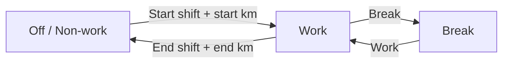

# Driver guide — Circadia24 EWD (simple English)

**For:** Drivers using the Circadia24 EWD app on a phone or tablet.

This guide explains how to use the app. It is **not** legal advice. Your company rules and WA commercial vehicle hours still apply.

---

## 1. What this app does

Circadia24 keeps your **weekly fatigue record** — an electronic work diary (EWD).

- You tap buttons when you **work**, take a **break**, or **end shift**.
- Time you do not log is counted as **non-work** (rest / off duty) — like blank time on a paper diary.
- If you drive the **same route often**, the app fills in **rego, from, to, and run plan** from your last trip. You always type **start km** and **end km** yourself.

---

## 2. Sign in

1. Open the app in your browser (or the installed app).
2. Type your **email** (provided or from your manager).
3. Type your **password** (provided or from your manager).
4. Tap **Sign in**.

You can change your password later in **Settings → Account → Change password**.

---

## 3. Drive home (the first screen)

After sign in you see **Drive**.

| On screen | Meaning |
|-----------|---------|
| Hi, [your name] | You are signed in |
| This week · [date] · Today · [date] | Which week and day you are in |
| Status card (Work / Break / Off) | What the app thinks you are doing now |
| **Log more work / Open this week** (green) | Open this week to log |
| **Produce 28 day roadside PDF** (amber) | One PDF for a regulator |
| **Your weeks** | Past and signed records |
| ⚙ (top right) | Settings and tools |

**Tip:** Tap **Log more work** each day when you start.

---

## 4. The log bar (main buttons)

At the top of **this week** you see big buttons. The buttons change to match what you are doing:

| Button | When it shows / what to tap |
|--------|------------------------------|
| **Start shift** | First work of a shift (needs start km first) |
| **Start Work / Work** | Begin or resume driving/on-duty work |
| **Break** | Short rest during work (30 minutes or less) |
| **Resume shift** | Continue the *same* shift after a short stop (when offered) |
| **End shift** | You finish work — enter finish time and end km |

```
┌─────────────────────────────┐
│ [ Start shift ] [ Break ]   │
│           [ End shift ]     │
└─────────────────────────────┘
```

### Activity flow



**Simple rule:** Tap the button that matches **what you are doing now**. Then **tap again within a few seconds** when the button pulses — that second tap is what records the event (Start shift, Work, Break, End shift).

**While the vehicle is moving** (when your organisation has the GPS trail addon on): Work / Break / End shift stay locked (beacon only). Pull over and wait a few seconds after you stop — then tap. If you already tapped once to confirm, the second tap still works.

You **cannot** start Work until **start km** is on today's card (see section 7).

---

## 5. Non-work time

- If you do **not** tap Work or Break, the app shows **non-work**.
- Rest **longer than 30 minutes** is **non-work**, not Break.
- **Break** is short rest during work (counts toward your 20 minutes rest per 5 hours of work).
- When you finish for the day, tap **End shift**. After that, time is non-work until you tap Work again.

---

## 6. End shift and kilometres (km)

When you tap **End shift**:

1. The app asks **when you finished** and your **end km**.
2. If your last Work/Break was on an **earlier day** (for example you forgot to end last night), choose the **finish date** — from that last log day through today — then the finish time.
3. Read the odometer and type the end km.
4. Confirm.

**Important:** The app **never** fills in start km or end km. You always read the truck and type them.

**If your shift runs past midnight:** just keep working. Your open work **continues across midnight** on the same timeline. There is **no** separate "end yesterday" step while you are still working — tap **End shift** only when you actually finish. Day cards are just labels; they do not end your shift.

**If you forget End shift:** the app may show a reminder (for example after a long stretch with no new log). Tap **End shift**, pick the **date and time you actually finished** (not only today's clock), and enter end km.

---

## 7. Today's card — repeat routes (most days)

Many drivers use the **same rego and route** every day. The app remembers your last trip.

| Field | Auto-filled? |
|-------|--------------|
| **Rego** (number plate) | Yes — from last trip or earlier this week |
| **From** / **To** | Yes |
| **Run plan** (name, hours, distance) | Yes, if you used it before |
| **Start km** | **No — you type this every day** |
| **End km** | **No — you type this at End shift** |

```
┌─────────────────────────────┐
│  Wednesday                  │
│  From: Perth depot          │
│  To:   Kalgoorlie           │
│  Rego: 1ABC123              │
│                             │
│  Start km (required):       │
│  [ _________ ]  ← you type  │
└─────────────────────────────┘
```

**Normal day:** open the week → check From/To/Rego → type **start km** → tap **Start shift**.

### Set up day / Edit day

Use **Set up day** (or **Edit day**) when something changes:

- New truck (rego)
- New run (from / to)
- A saved **run plan**, a **custom trip**, or **no run plan**
- **Shift pattern** — Day (A) or Night (B)
- **Solo** or **Two-up**, and the **relief driver's name**
- **Last 24-hour break** date (week record — under crew, above route setup in Set up day / Edit day). You can change it until you **sign** the week; after that only your manager can amend.
- **Last 2 × 24 hour non-work breaks** (two dates) — only when the app needs them because it does not yet have enough of your past days. This is part of your legal week record. If you are already on shift, tap **Set up week record** on the upcoming compliance banner, Work warning, or compliance snapshot — it opens Set up day on the field you need.

---

## 8. Two-up drivers

If your sheet is **Two-up**:

- Enter the **relief driver's name** in Set up day (for context).
- Log **only your own** work, break, and end-shift times on **your** sheet.
- The relief driver keeps **their own** sheet.
- Two-up uses different rest rules than solo.

---

## 9. Sign your week

You can sign your week sheet **only after the week has finished** — just like handing in a paper sheet at the end of the week.

1. Open the finished week from **Your weeks** (or the reminder).
2. Check the information on each day. Fix route or times if needed.
3. Tap **Sign record**.
4. Your signature means: **"This is a true record of my week."**

After you sign, that week is **locked** for you. If something is wrong, tell your manager. They amend it with a reason, and you **sign again**.

Unsigned past weeks show as gentle reminders. They **do not** block logging on this week.

---

## 10. Why the app works this way

Drivers often ask why they can't do certain things. Here are the reasons:

| You cannot… | Why |
|-------------|-----|
| **Sign this week early** | You sign only **after the week ends** (from your usual week ending day). It is the same as paper: you hand the sheet in once the week is finished. Signing early would lock the week and stop you logging any more work. |
| **Log live Work/Break on a past week** | Live buttons work on the **current week** only. On a past week you can fix route or times, then sign. This keeps "now" and "history" separate. |
| **Edit a week after you sign it** | Your signature is the **legal record**. To change a signed week, your manager amends it (with a reason on file) and you re-sign the corrected version. This protects you and stops silent changes. |
| **Have the app fill in km** | Start km and end km are read from the **truck odometer**. Only you can see it, so only you type it. |
| **"End yesterday's shift" separately** | Open work carries across midnight until you End shift. |
| **Switch Day↔Night freely after a long run** | After about five 24-hour stretches on the same pattern (A or B), changing pattern needs enough hours off first. This follows the shift-change rule. |

---

## 11. Your weeks (list)

Menu: **Your weeks** (`/sheets`)

| Label | Meaning |
|-------|---------|
| Current week | Log Work / Break / End shift here |
| Needs signature | Finished week — open, check, sign |
| Signed | Locked — read only for you |

---

## 12. Roadside PDF (to give to Main Roads Inspector or Police etc)

When an officer asks to see your records:

- Tap **Produce 28 day roadside PDF** on **Drive home**, on your **week sheet** (Day tools → Roadside), or in **Settings**.
- It builds one PDF of your **last 28 calendar days** — diary grids, compliance summary, and shift log per week.
- It works **offline** from saved weeks. Share or show it on your phone.

You must keep signed records for at least **3 years** — this export is for roadside produce only.

---

## 13. Day tools, compliance, and shift log

On the week sheet:

- **Day tools** (clipboard icon) — week summary, last 24-hour break, **Compliance**, **Roadside**, records to sign, and Settings.
- **Compliance** — shows if your week meets the rest/hours rules, with plain-language notes.
- **Shift log** — a list of every event on your record.

---

## 14. Voice & display

Tap **Voice & display** on the log bar for:

- **Voice commands** — log by speaking (where supported).
- **Voice alerts** — spoken reminders while logging.
- **Dark mode** — easier on the eyes at night.

You can also set **Dark mode** and **Voice alerts** in **Settings → Options**.

---

## 15. Settings

Gear icon → **Settings**:

- **Options** — Dark mode, Voice alerts.
- **Device** — install the app, back up / restore on this device.
- **Records** — past weeks that need your signature.
- **Drive** — This week, Your weeks, Driver guide (pictures), How your record works, Route catalogue.
- **Connect** — Messages, Manager sign-in.
- **Account** — Change password, Sign out.

---

## 16. Messages

**Settings → Messages** (`/driver/messages`) — talk to your manager inside the app.

---

## 17. Medical reminder

If your manager saved a **medical expiry date**, you may see a **yellow** or **red** banner. Book your medical and ask your manager to update the date.

---

## 18. Each-day checklist

1. Sign in (or stay signed in)
2. **Log more work**
3. Check rego, from, and to on today's card
4. Type **start km**
5. Tap **Start shift** when you begin
6. Tap **Break** for short rest
7. Tap **End shift** when finished — enter finish time and end km
8. When the **week has ended** — **Sign**

---

## 19. Glossary

| Word | Meaning |
|------|---------|
| Work | Solo means driving or working. Two-up means driving. |
| Break | Short rest (≤30 min) during work |
| Non-work | Off duty / long rest / sleep / in sleeper cab for two-up |
| Start shift / End shift | Begin / finish work for a shift |
| Resume shift | Continue the same shift — this is not the same as start / finish break. |
| Week | Sunday–Saturday slice of your record |
| Sign | You attest the week is correct |
| Rego | Number plate |
| Start km / End km | Odometer readings you type |
| Set up day | Change route, truck, pattern, or crew |
| Run plan | Optional saved route (name, hours, km) |
| Roadside PDF | 28-day record for a regulator |
