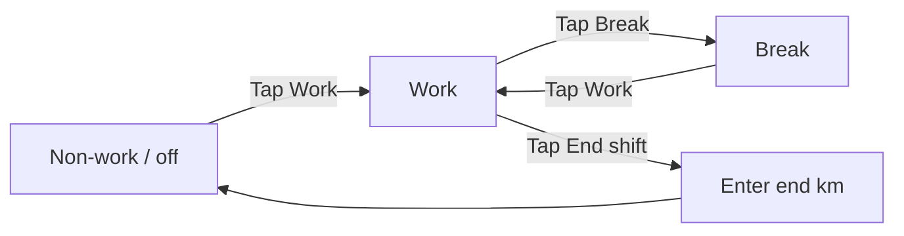

# Driver UI guide (simple English)

**For:** Drivers who use Circadia 24 on a phone or tablet.  
**Language:** Short sentences. Common words. Pictures and diagrams below.

---

## 1. What this app does

Circadia 24 keeps your **weekly fatigue record**.

- You tap buttons when you **work**, **break**, or **end shift**.
- Time you do not log is shown as **non-work** (rest / off duty).
- Each **week** (Sunday to Saturday) is one record. You **sign** the week when it is correct.
- If you drive the **same route often**, the app **fills in rego, from, to, and run plan** from your last trip. You still enter **truck km yourself** every time.

This guide is **not** legal advice. Your company and WA rules still apply.

---

## 2. Sign in

1. Open the app in your browser.
2. Type your **email** (from your manager).
3. Type your **password** (from your manager).
4. Tap **Sign in**.

```
┌─────────────────────────────┐
│  Email:  you@company.com    │
│  Password: ••••••            │
│         [ Sign in ]         │
└─────────────────────────────┘
```

---

## 3. Home screen (“Drive home”)

After sign in you see **Drive home**.

| On screen | Meaning |
|-----------|---------|
| Your name | You are signed in |
| Today / This week | Which day and week you are in |
| **Continue logging** (green button) | Open **this week** to log work |
| **Produce 28 day roadside PDF** (amber button) | One PDF for regulator inspection |

```
┌─────────────────────────────┐
│  ◀  Circadia 24      ⚙      │
│  Hello, [Your name]         │
│  Today: Wednesday           │
│  Week: 1 Jun 2026           │
│                             │
│  ┌─────────────────────┐    │
│  │ Continue logging  ▶ │    │
│  └─────────────────────┘    │
│  [ Produce 28 day roadside PDF ]   │
│  Your weeks              ▶  │
└─────────────────────────────┘
```

**Tip:** Use **Continue logging** every day when you start work.

---

## 4. The log bar (main buttons)

At the top of **this week** you see three big buttons:

| Button | When to tap |
|--------|-------------|
| **Work** (or **Start shift**) | You start driving / working |
| **Break** | Short rest during work (≤ 30 minutes) |
| **End shift** | You finish work for this shift |

```
┌─────────────────────────────┐
│  [ Work ] [ Break ] [ End ] │
│         shift               │
└─────────────────────────────┘
```

### Activity flow (diagram)



**Simple rule:** Tap the button that matches **what you are doing now**.

You cannot tap **Work / Start shift** until **start km** is on today’s card (see section 7).

---

## 5. Non-work time

- If you do **not** tap Work or Break, the app shows **non-work**.
- Long rest (**more than 30 minutes**) is **non-work**, not Break.
- **Break** is for short rest during work.
- When you stop working for the day, tap **End shift**. After that, time is non-work until you tap Work again.

---

## 6. End shift and kilometres (km)

When you tap **End shift**:

1. The app may ask for **end km** on the odometer.
2. Enter the number from the truck.
3. Confirm.

**Important:** The app **never** fills in start km or end km for you. You read the odometer and type it.

If you **forget** End shift:

- The app may show a reminder.
- Tap **End shift** and enter **when you finished** and **end km**.
- If the **prior day** was not ended, a banner may say **End shift on [day name]** — same dialog; pick the correct finish time.

---

## 7. Day card — repeat routes (most days)

Many drivers use the **same rego and route** every day. The app remembers your last trip.

### What fills in automatically

| Field | Auto-filled? |
|-------|----------------|
| **Rego** (number plate) | Yes — from last trip or yesterday this week |
| **From** (start location) | Yes |
| **To** (destination) | Yes |
| **Run plan** (route name, hours, distance) | Yes, if you used it before |
| **Start km** | **No — you always enter this** |
| **End km** | **No — you enter when you End shift** |

After you **sign in** and open **this week**, today’s card often looks like this:

```
┌─────────────────────────────┐
│  Wednesday                  │
│  From: Perth depot          │
│  To:   Kalgoorlie           │
│  Rego: 1ABC123               │
│                             │
│  Start km (required):       │
│  [ _________ ]  ← you type  │
│                             │
│  Rego and route are filled  │
│  from your last trip.       │
└─────────────────────────────┘
```

### What you do (normal day)

1. Open **Continue logging**.
2. **Check** From, To, and Rego are correct (change with **Edit day** if not).
3. Type **start km** in the box on the card (or in **Set up day**).
4. Tap **Work** or **Start shift**.

**First time** on a new phone, or a **new route**: tap **Set up day**, fill all fields once, then save. The next days are faster.

### Set up day (when route changes)

Use **Set up day** / **Edit day** when:

- New truck (rego)
- New run (from / to)
- Run plan changes (hours or km distance)

Do **not** expect the app to guess odometer readings.

---

## 8. Two drivers (two-up)

If your sheet is **Two-Up**:

- Enter the **relief driver&apos;s name** in Set up day (for context only).
- Log **only your own** work, break, non-work, and end-shift times on **your** sheet.
- The relief driver keeps **their own** sheet for their times.
- Two-Up uses different rest rules than solo (see Compliance).

---

## 9. Sign your week

When the week is finished and correct:

1. Open **this week** (or the week from **Your weeks**).
2. Read each day.
3. Tap **Sign** (or **Sign this week’s record**).
4. Your **signature** means: “This record is true.”

```
┌─────────────────────────────┐
│  Sign this week's record    │
│  Review days below, then    │
│  sign when correct.         │
│         [ Sign ]            │
└─────────────────────────────┘
```

**After you sign:**

- That week is **locked** for you.
- If something is wrong, **talk to your manager**. They can fix with a reason. You **sign again**.

**Past weeks not signed:** You can still open them and sign. They do not block logging on **this week**.

---

## 10. Your weeks (list)

Menu: **Your weeks** (`/sheets`)

| Label you may see | Meaning |
|-------------------|---------|
| Current week | Log Work / Break / End shift here |
| Unsigned past week | Open, fix, then sign |
| Signed | Locked — read only for you |

---

## 11. Produce 28 day roadside PDF

When a **regulator** asks to see your records:

| Place | Use |
|-------|-----|
| **Drive home** — amber **Produce 28 day roadside PDF** | Opens one PDF with your last 28 calendar days |
| **This week** — same amber strip under compliance | Same PDF |
| **Settings** (gear) → **Produce 28 day roadside PDF** | Same PDF |
| **How roadside produce works** | Short help page (`/driver/roadside`) |

The PDF includes each weekly sheet in that period (diary, compliance summary, shift log). Keep signed records for at least **3 years** — this export is for roadside produce only.

---

## 12. Messages and settings

| Place | Use |
|-------|-----|
| **Settings** (gear icon) | Help, messages, sign out |
| **Driver guide (pictures)** | Full guide in the app |
| **How your record works** | Short help |
| **Messages** | Talk to your manager |

---

## 13. Commercial Driver's Medical (reminder)

If your manager saved a **medical expiry date** for you:

- You may see a **yellow** or **red** banner on your sheet.
- Book your medical and tell your manager to update the date in **Approved Drivers**.

---

## 14. Quick checklist (each day)

1. **Sign in** (or stay signed in)  
2. **Continue logging**  
3. **Check** rego, from, and to on today’s card (already filled most days)  
4. Enter **start km** on the card  
5. Tap **Work** when you start  
6. Tap **Break** for short rest  
7. Tap **End shift** when finished — enter **end km**  
8. At end of week: **Sign**

---

## 15. Words you may see (glossary)

| Word | Simple meaning |
|------|----------------|
| **Work** | Driving or on-duty work |
| **Break** | Short rest (≤ 30 min) during work |
| **Non-work** | Off duty / long rest / sleep |
| **End shift** | Finished work for this shift |
| **Week** | Sunday–Saturday record |
| **Sign** | You agree the week is correct |
| **Rego** | Number plate |
| **From** | Where the shift / route started |
| **To** | Destination |
| **Start km** | Odometer when you start (you type this) |
| **End km** | Odometer when you end shift (you type this) |
| **Set up day** | Form to change route or truck details |
| **Run plan** | Optional future route (name, hours, km) |
| **Sheet** | One week’s record |

---

## 16. Need help?

- **Settings → Driver guide (pictures)** in the app.  
- **Settings → How your record works** for rules overview.  
- Ask your **manager**.  
- This file: `docs/user-guides/driver-ui-guide-esl.md`
