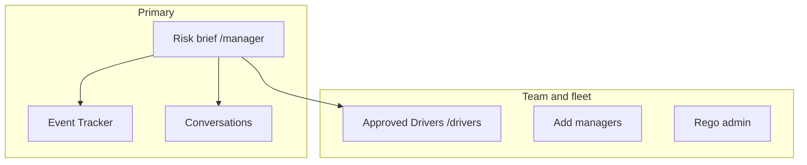

# Manager UI guide

**For:** Fleet managers, supervisors, and compliance staff using Circadia 24 on a desktop or laptop (mobile supported as a fallback).  
**Language:** Mid-level English — assumes familiarity with fatigue rules and roster management.

---

## 1. Purpose of the manager UI

The manager experience is a **fleet risk brief**, not an enforcement tool. It helps you:

- See **fatigue exposure** and **record quality** early in the work week.
- **Coach drivers** before small gaps become incidents or breaches.
- **Amend** genuine errors on weekly records with an audited reason, then return the sheet for **driver re-signature**.

Circadia separates **retrospective compliance** (what was logged) from **prospective risk** (declared future run plans). Manager copy and reference libraries explain ISO 31000 / IEC 31010 thinking; outputs are guidance, not legal determinations.

---

## 2. Navigation overview

| Route | Function |
|-------|----------|
| **Risk brief** (`/manager`) | Weekly fleet view, tiers, register, workbench |
| **Event Tracker** | Logged events with location on a map for assurance |
| **Conversations** | Manager–driver messaging |
| **Drivers** | Roster, login email, optional Commercial Driver's Medical expiry, passwords |
| **Managers** | Create other manager accounts |
| **Rego** | Vehicle registration reference data |
| **Test desk** | Inject test alerts; set **WAHVA maintenance contact** (workshop email for fault reporting) |
| **User guide** (`/manager/help`) | This guide in the app |

Layout is **monitor-first**: multi-column grids on wide screens; stacks on phones.

### Domain overview cards (top of Driver Overview)

Three cards link to anchored sections on the same page:

| Card | Section anchor | Live badge |
|------|----------------|------------|
| **1. Risk analysis** | `#risk-analysis` | Drivers in **Needs attention** or **Elevated exposure** for the selected week |
| **2. Compliance Analysis** | `#compliance-analysis` | Rule **breaches** on attested sheets for the selected week |
| **3. Records & amendments** | `#record-edits` | **Unsigned** weekly sheets for the selected week |

Badges update when you change work week or driver scope. **All clear** means nothing actionable in that section for the current filters. Clicking a card smooth-scrolls to the section (sticky subnav offset is handled via `scroll-mt-24` on each section).

---

## 3. Risk brief — week at a glance

### Hero tier counts

For the **selected work week**, the hero summarises drivers into four tiers:

| Tier | Typical meaning |
|------|-----------------|
| **Needs attention** | Rule breach, serious corroboration gap, or imminent fatigue risk |
| **Elevated exposure** | Warnings, near-term break/recovery pressure, or high prospective risk on a declared leg |
| **Monitor** | Unsigned week, thin GPS, housekeeping signals — verify before relying on the record |
| **Assurance looks steady** | No elevated composite signals for that week in visible data |

Tier is a **composite** — not a single rule. Use it to prioritise conversations, not automatic discipline.

### Assurance signals

Shows **compliance rule outcomes** on weekly sheets for the selected week and the week before. Framed for learning; rolling checks may read further history than the visible panel.

### Fleet risk pulse (heatmap)

The fleet heatmap uses a **fluid grid** of 15-minute blocks: it grows with the panel on wide screens and scrolls horizontally only when the window is too narrow (no whole-page sideways scroll). The driver column stays fixed while you pan the timeline. **← →** buttons appear when more timeline is off-screen; you can also swipe on touch devices or use the keyboard when the timeline is focused. On load, the view centres on **right now**.

### Reference libraries (collapsible)

Two card libraries open from the risk brief:

1. **Fatigue & assurance reference** — retention vs lookback, chain of responsibility, circadian context, record strength.
2. **Prospective risk reference (ISO 31000 / IEC 31010)** — compliance vs risk split, scenario analysis, barriers, out-of-scope items.

Use these when coaching staff or explaining why a signal appeared.

---

## 4. Driver exposure register

One row per driver for the selected week. **Driver names are bold** for fast scanning; tier chips use solid colour fills (rose / amber / sky / emerald) so severity stands out at a glance. Columns include tier, top signal, compliance lines, and prospective risk lines where run plans exist.

**Practice:**

- Sort/filter by tier or “unsigned”.
- Open **Open record** to jump to the weekly sheet workbench.
- Use **conversation starter** text when messaging — optional, editable.

**False positives:** Unsigned week + weak GPS alone should land in **Monitor**, not Elevated exposure. Elevated should reflect fatigue exposure or prospective legs, not housekeeping alone.

---

## 5. Weekly review workbench

Choose **work week** and **day**, then:

### Tab: Identify risk

Filters: needs attention, record gaps, unsigned weeks, next 24 hours.  
Leading indicators from live events (break timing, long work blocks) — reach out to **understand**, not to accuse.

### Tab: Records & amendments

Open a driver sheet in manager mode — start with the **Driver sheet** dropdown at the top of the section (teal highlight). It lists weekly sheets for your current week, day, and scope filters.

- Edit past-week facts only with a **reason** (audited).
- You may amend multiple times while aligning with the driver.
- When content is agreed, ask the driver to **sign again** — manager edit is not the legal attestation.
- **Last 2 × 24 hour non-work breaks** (when the app needs them; sometimes 4) — each with absolute start and end times — can be corrected on the sheet workbench — same fields the driver sets in Set up day. Soft-reset for 17h / 72h follows the most recent rest end.
- Compliance warnings on the workbench and assurance list include a **Fix on record** (or **Fix this day**) button that jumps straight to the field or day — not just a report.
- On a driver day card, **Edit day** includes the declared 2×/4× 24h rest start/end times (managers can amend locked values there).

Copy reminder: *“When you and the driver agree the week is correct, ask them to open it from Your Sheets and sign.”*

---

## 6. Approved Drivers (`/drivers`)

Roster maintenance:

| Field | Notes |
|-------|--------|
| Name / email | Login identity |
| Licence | Optional |
| Commercial Driver's Medical expiry | Optional WA reminder on matching sheets |
| Password | Plain text on screen for setup; min 6 characters |
| Active | Inactive drivers hidden from selection |

Add-driver form uses a **three-column desktop grid**; stacks on narrow screens.

**Driver day cards:** For repeat runs (e.g. MTS), the driver app autofills **rego, start location, destination, and run plan** from the driver’s last saved trip or yesterday on the same week. **Odometer (start/end km) is never autofilled** — drivers enter km on the day card, then tap Work. Expect faster logging; first trip on a new device still needs **Set up day** once.

---

## 7. Event Tracker

Geographic view of logged work, breaks, and shift ends that have a location. Filter by **week**, **day**, and **driver**. Use for **corroboration** conversations — absence of a location is a record-quality signal, not proof of misconduct by itself.

When present, a solid sky line into a marker is the driver’s **GPS movement trail since the previous log** (stationary waits are omitted). It is not live fleet tracking. This trail is an **optional enterprise addon** — enable or disable it on **Test desk** or **Security**. Trails only appear for logs made while the addon is on.

---

## 7b. WAHVA maintenance contact

On **Test desk** (managers) or **Owner console → Security** (owners), set the organisation’s **workshop / maintenance contact** (name, company, email, phone). This is the destination for vehicle fault reports required for WAHVA accreditation. Automatic email of prestart defects is not enabled yet — the contact is stored so the reporting pathway can use it next.

---

## 8. Conversations

Threaded messages with drivers. Types include operational notes, training requests, and correction requests. Keeps outreach adjacent to the risk brief without replacing your HR process.

---

## 9. Prospective risk (driver-declared plans)

Drivers may declare **future run plans** (route name, expected hours/km). The risk engine scores **future segments only**; once a day is logged, it lives in compliance only.

Manager role:

- Discuss plans before the week is signed.
- Encourage realistic plans and rest when **elevated** prospective lines appear.
- Do not treat prospective tiers as automatic violations.

See ADR 0003 and the prospective risk reference library on the risk brief.

---

## 10. What the manager UI is not

- Not NHVR product certification or FRMSc biomathematical scoring.
- Not a substitute for legal advice, medical fitness decisions, or formal investigations.
- Not automatic discipline — document conversations and agreed changes.

---

## 11. Suggested weekly workflow

1. Open **Risk brief** for the current work week.  
2. Review tier counts and **assurance signals**.  
3. Work the **register** — check-ins for Needs attention / Elevated first.  
4. Open sheets for unsigned weeks or record gaps; amend only with reason if needed.  
5. Confirm roster data in **Drivers** (medical expiry, active flag).  
6. Use **Conversations** to close the loop; ask drivers to **sign** when records are agreed.

---

## 12. Further reading

| Topic | Location |
|-------|----------|
| Record retention vs rule lookback | `docs/regulatory/record-retention-and-compliance-lookback.md` |
| Prospective risk ADR | `docs/adr/0003-prospective-risk-engine.md` |
| Commercial Driver's Medical | `docs/architecture/wa-cvd-medical-s7.md` |
| In-app help | `/manager/help` |
