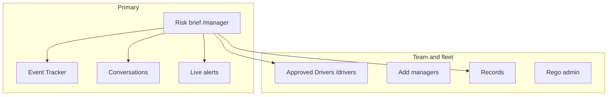

# Manager UI guide

**For:** Fleet managers, supervisors, and compliance staff using Circadia24 on a desktop or laptop (mobile supported as a fallback).  
**Language:** Mid-level English — assumes familiarity with fatigue rules and roster management.

---

## 1. Purpose of the manager UI

The manager experience is a **fleet risk brief**, not an enforcement tool. It helps you:

- See **fatigue exposure** and **record quality** early in the work week.
- **Coach drivers** before small gaps become incidents or breaches.
- **Amend** genuine errors on weekly records with an audited reason, then return the sheet for **driver re-signature**.

Circadia separates **retrospective compliance** (what was logged) from **prospective risk** (declared future run plans). Manager copy and reference libraries explain ISO 31000 / IEC 31010 thinking; outputs are guidance, not legal determinations.

---

## 2. Navigation overview

| Route | Function |
|-------|----------|
| **Risk brief** (`/manager`) | Weekly fleet view, tiers, register, workbench |
| **Event Tracker** | Logged events with location — markers only, no lines joining events |
| **Conversations** | Manager–driver messaging |
| **Live alerts** | Camera fatigue signals — desktop desk: clip on the left, decision on the right |
| **Drivers** | Roster, login email, licence number, licence expiry, Commercial Driver Medical expiry (all required; dates **dd/mm/yyyy**), passwords (managers can set temporary passwords; drivers can also use **Forgot password?** on sign-in) |
| **Managers** | Create other manager accounts |
| **Records** (`/manager/records`) | Roster drivers on the left; pick a **week by date** (previous weeks first). Under that week, separate subjects: **Fatigue sheet**, **Fitness for work record**, **Prime Mover / Rigid Pre-departure Checklist**, **Trailer Pre-departure Checklist**, **Forklift Prestart**, **Load checks**, **Hook ups**, **Fault reports**. Each has **View week record** and **Export PDF**. Fatigue view opens the sheet; checklist view opens that week’s signed forms of that type only (read only). Export PDF is the Weekly Trip Sheet for fatigue, or that type’s checklist PDFs for the others (disabled when that week has none). Checklist PDFs are **one sheet per signed log**, dated **week ending** (not signed time). Fitness for Work is named per driver; vehicle and load checks per vehicle rego; hook-up per driver and rego. Types are never combined. For managers and WAHVA auditors. |
| **Rego** | Vehicle catalogue: plate, **Type** (Prime mover / Rigid / Van / Trailer / Other), **GVM (t)** and **GCM (t)** on powered units, **ATM (t)** on trailers, **Tare (t)** on every unit, **Number of axles**, and **WAHVA Accredited** (RAV permit vehicle). Required when adding or editing a rego. Drivers pick the plate on Set up day and on each form (filtered by type — Type a plate if it is not listed); the masses that apply show next to the plate on the day sheet for load check. A **Prime mover** plate highlights **Hook up** as a reminder (not required). |
| **Test desk** | Inject test alerts |
| **Owner console** (`/admin/security`) | Owners: **operator name** (printed as OPERATOR on weekly trip sheet PDFs), **Checklist PDF pack emails** (pack + two spares), **workshop contact** (workshop + two spare fault inboxes), lockdown, users, audit |
| **User guide** (`/manager/help`) | This guide in the app |

Layout is **monitor-first**: multi-column grids on wide screens; stacks on phones.

### Domain overview cards (top of Driver Overview)

Three cards link to anchored sections on the same page:

| Card | Section anchor | Live badge |
|------|----------------|------------|
| **1. Risk analysis** | `#risk-analysis` | Drivers in **Needs attention** or **Elevated exposure** for the selected week |
| **2. Compliance Analysis** | `#compliance-analysis` | Rule **breaches** on attested sheets for the selected week |
| **3. Records & amendments** | `#record-edits` | **Unsigned** weekly sheets for the selected week |

Badges update when you change work week or driver scope. **All clear** means nothing actionable in that section for the current filters. Clicking a card smooth-scrolls to the section (sticky subnav offset is handled via `scroll-mt-24` on each section).

### Older records (live vs long-term storage)

Above the week / day / driver filters on Driver Overview:

- **Recent weeks** load instantly from the live system (week picker).
- **Older retained records** (electronic data + signature) may sit in long-term storage when Circadia graduates history off the live database. That is **not** the same as clicking any date in the last three years.
- Use **Older records** to request a formal pack (audit, legal hold, regulator). Standard retrieval is about **2 business days** (Perth). Circadia delivers the **electronic source of truth**; a PDF can be regenerated from that data if you need a printable copy. Ops fulfill via the cold-access runbook (decrypt R2 dump if needed, extract SoR JSON pack).

Pilot note: all signed weeks are still on the live system today — the request button is for formal packs / holds, not everyday browsing.

---

## 3. Risk brief — week at a glance

### Hero tier counts

For the **selected work week**, the hero summarises drivers into four tiers:

| Tier | Typical meaning |
|------|-----------------|
| **Needs attention** | Rule breach, serious corroboration gap, or imminent fatigue risk |
| **Elevated exposure** | Warnings, near-term break/recovery pressure, or high prospective risk on a declared leg |
| **Monitor** | Unsigned week, thin GPS, housekeeping signals — verify before relying on the record |
| **Assurance looks steady** | No elevated composite signals for that week in visible data |

Tier is a **composite** — not a single rule. Use it to prioritise conversations, not automatic discipline.

### Assurance signals

Shows **compliance rule outcomes** on weekly sheets for the selected week and the week before. Framed for learning; rolling checks may read further history than the visible panel.

### Fleet risk pulse (heatmap)

The fleet heatmap uses a **fluid grid** of 15-minute blocks: it grows with the panel on wide screens and scrolls horizontally only when the window is too narrow (no whole-page sideways scroll). The driver column stays fixed while you pan the timeline. **← →** buttons appear when more timeline is off-screen; you can also swipe on touch devices or use the keyboard when the timeline is focused. On load, the view centres on **right now**.

**Individual risk** (the chart for one driver) has a colour bar under the line. **Solid** Work / Break / Non-work colours are recorded duty **before now**. **Stripes** after now are a fatigue-risk forecast (grey to purple). They are not a planned Break. Hover a striped block for the risk percent.

### Reference libraries (collapsible)

Two card libraries open from the risk brief:

1. **Fatigue & assurance reference** — retention vs lookback, chain of responsibility, circadian context, record strength.
2. **Prospective risk reference (ISO 31000 / IEC 31010)** — compliance vs risk split, scenario analysis, barriers, out-of-scope items.

Use these when coaching staff or explaining why a signal appeared.

---

## 4. Driver exposure register

One row per driver for the selected week. **Driver names are bold** for fast scanning. The coloured chip **names the leading issue** (for example **Break overdue**, **Recovery in progress**, **17h episode**, **Week not signed**) — rose / amber / sky / emerald still show urgency (attention, elevated, monitor, steady). **Recovery in progress** is the 7h rest clock after End shift — not a breach. The line under the name adds the time or rule detail. Hover the chip for the same detail.

**Practice:**

- Sort/filter by tier or “unsigned”.
- Open **Open record** to jump to the weekly sheet workbench.
- Use **conversation starter** text when messaging — optional, editable.

**False positives:** Unsigned week + weak GPS alone should land in **Monitor**, not Elevated exposure. Elevated should reflect fatigue exposure or prospective legs, not housekeeping alone.

---

## 5. Weekly review workbench

Choose **work week** and **day**, then:

### Tab: Identify risk

Filters: needs attention, record gaps, unsigned weeks, next 24 hours.  
Leading indicators from live events (break timing, long work blocks, recovery windows) on the **rolling** timeline — reach out to **understand**, not to accuse. The driver EWD shows the 5-hour break reminder on the ring countdown only (amber at 45 minutes left, red at 15). Upcoming on the log bar names rest window after End shift, shift still open after 7 hours, and **compliance issues after a breach** — it does not repeat the break reminder.

### Tab: Records & amendments

Open a driver sheet in manager mode — start with the **Driver sheet** dropdown at the top of the section (teal highlight). It lists weekly sheets for your current week, day, and scope filters.

- Edit past-week facts only with a **reason** (audited).
- You may amend multiple times while aligning with the driver.
- When content is agreed, ask the driver to **sign again** — manager edit is not the legal attestation.
- **Last 2 × 24 hour non-work breaks** (when the app needs them; sometimes 4) — set the start for each (end fills 24 hours later) — can be corrected on the sheet workbench — same fields the driver sets in Set up day. Soft-reset for 17h / 72h follows the most recent rest end.
- Compliance warnings on the workbench and assurance list include a **Fix on record** (or **Fix this day**) button that jumps straight to the field or day — not just a report.
- On a driver day card, **Edit day** includes the declared 2×/4× 24h rest starts (end fills 24 hours later; managers can amend locked values there). Two dates are the 14-day option; four dates are the 28-day alternative (also needs ≤144h work in any 14 days inside that 28). You do not need both options.

Copy reminder: *“When you and the driver agree the week is correct, ask them to open it from Your Sheets and sign.”*

---

## 6. Approved Drivers (`/drivers`)

Roster maintenance:

| Field | Notes |
|-------|--------|
| Name / email | Login identity |
| Licence number | Required. Printed after the driver name on weekly trip sheet PDFs |
| Commercial Driver Medical expiry | Required. Enter as **dd/mm/yyyy**. Printed on weekly trip sheet PDFs; in-app reminders on matching sheets |
| Driver licence expiry | Required. **dd/mm/yyyy**. Printed on weekly trip sheet PDFs |
| Password | Plain text on screen for setup; min 6 characters |
| Active | Inactive drivers hidden from selection |

Add-driver form uses a **three-column desktop grid**; stacks on narrow screens.

**Driver day cards:** For repeat runs (e.g. MTS), **Set up day** can suggest **rego, start location, destination, and run plan** from the driver’s last saved trip when they **start** a shift. Those fields appear on that card and the PDF **after Confirm**. **Once the shift is open, later day cards show the same rego and route** without another Confirm — day names are labels only. **Odometer (start/end km) is never suggested** — drivers enter km themselves. Expect faster setup; first trip on a new device still needs **Set up day** once.

---

## 7. Event Tracker

Geographic view of logged work, breaks, and shift ends that have a location. Filter by **week**, **day**, and **driver**. Markers only — no lines joining events. The GPS movement trail addon does not draw lines here; it is for Work / Break lock while moving. Use for **corroboration** conversations — absence of a location is a record-quality signal, not proof of misconduct by itself.

---

## 7b. Checklist PDF pack emails and WAHVA maintenance contact

Owners set the **operator name** (organisation legal name) on **Owner console**. That is the **OPERATOR** line on weekly trip sheet PDFs. It is one name for the fleet — not typed on Drive home.

On **Owner console → Security** (Enterprise owners):

- **Checklist PDF pack emails** (pack email, spare email 1, spare email 2) — fleet destinations for Fitness for Work / Prime Mover / Rigid Pre-departure Checklist / Trailer Pre-departure Checklist / Forklift Prestart / Load / Hook up / Fault report PDFs (**Email checklist PDFs** on the day card). One PDF per signed log, dated **week ending**. Not the 28-day fatigue roadside PDF. Not on the client manager Test desk. Not on driver Settings. Sending also needs server mail (`RESEND_API_KEY` + `EMAIL_FROM`).
- **Workshop / maintenance contact** (name, company, workshop email, spare email 1, spare email 2) — destination for vehicle fault reports required for WAHVA accreditation. Immediate email of vehicle / trailer / forklift pre-departure defects uses every filled address when a Fault is saved. Not on the client manager Test desk. Not on driver Settings.

---

## 8. Conversations

Threaded messages with drivers. Types include operational notes, training requests, and correction requests. Keeps outreach adjacent to the risk brief without replacing your HR process.

---

## 9. Prospective risk (driver-declared plans)

Drivers may declare **future run plans** (route name, expected hours/km). The risk engine scores **future segments only**; once a day is logged, it lives in compliance only.

Manager role:

- Discuss plans before the week is signed.
- Encourage realistic plans and rest when **elevated** prospective lines appear.
- Do not treat prospective tiers as automatic violations.

See ADR 0003 and the prospective risk reference library on the risk brief.

---

## 10. What the manager UI is not

- Not NHVR product certification or FRMSc biomathematical scoring.
- Not a substitute for legal advice, medical fitness decisions, or formal investigations.
- Not automatic discipline — document conversations and agreed changes.

---

## 11. Suggested weekly workflow

1. Open **Risk brief** for the current work week.  
2. Review tier counts and **assurance signals**.  
3. Work the **register** — check-ins for Needs attention / Elevated first.  
4. Open sheets for unsigned weeks or record gaps; amend only with reason if needed.  
5. Confirm roster data in **Drivers** (licence number, medical expiry, licence expiry, active flag).  
6. Use **Conversations** to close the loop; ask drivers to **sign** when records are agreed.

---

## 12. Further reading

| Topic | Location |
|-------|----------|
| Record retention vs rule lookback | `docs/regulatory/record-retention-and-compliance-lookback.md` |
| Prospective risk ADR | `docs/adr/0003-prospective-risk-engine.md` |
| Commercial Driver Medical | `docs/architecture/wa-cvd-medical-s7.md` |
| In-app help | `/manager/help` |
